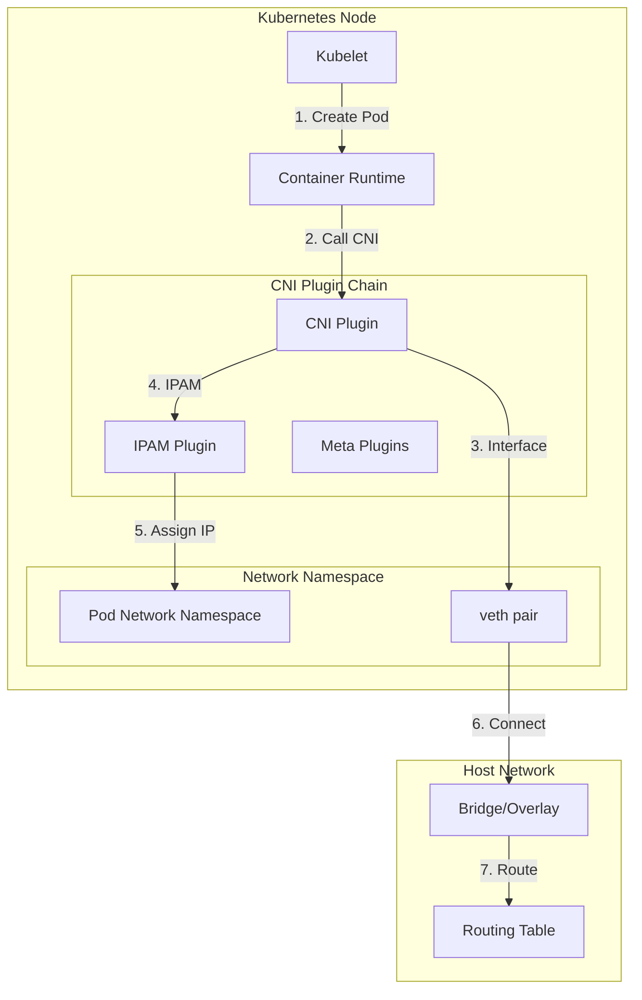
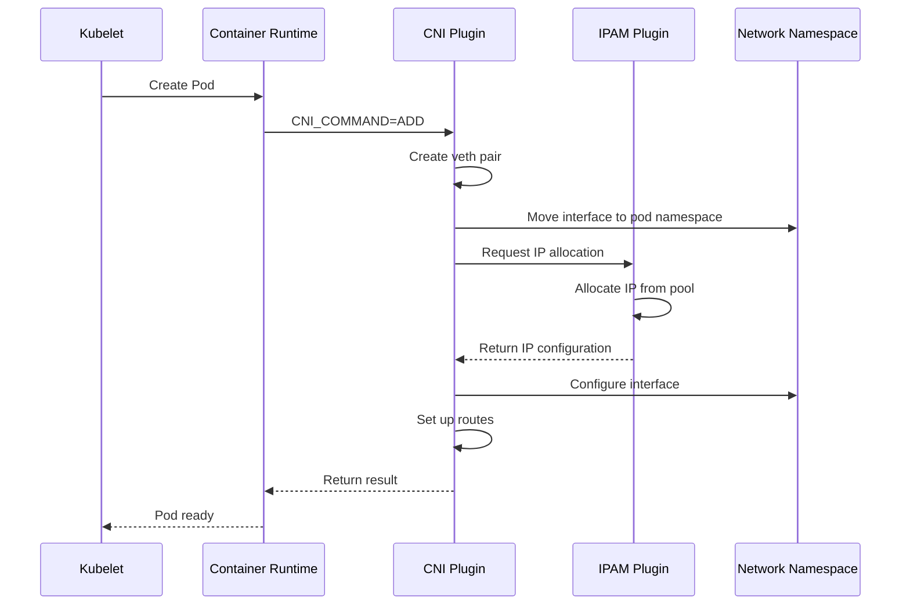

# 🌐 Kubernetes Container Network Interface (CNI)

<div align="center">
  
[](https://kubernetes.io/docs/concepts/extend-kubernetes/compute-storage-net/network-plugins/)
[](https://www.cncf.io/projects/)
[](https://opensource.org/licenses/Apache-2.0)

</div>

## 📋 Table of Contents
 
- [Overview](#-overview)
- [Architecture](#-architecture)
- [Core Components](#-core-components)
- [How CNI Works](#-how-cni-works)
- [Available Plugins](#-available-plugins)
- [Configuration](#-configuration)
- [Implementation Guide](#-implementation-guide)
- [Best Practices](#-best-practices)
- [Troubleshooting](#-troubleshooting)
- [Contributing](#-contributing)

## 🔍 Overview

The **Container Network Interface (CNI)** is a Cloud Native Computing Foundation (CNCF) specification that defines how container runtimes should configure network interfaces for containers. CNI provides a standardized, plugin-based approach to networking in Kubernetes clusters.

### Key Benefits

- **Modular Architecture**: Choose from multiple networking solutions
- **Standardized Interface**: Consistent API across different runtimes
- **Pluggable Design**: Easy to swap or upgrade networking solutions
- **Vendor Agnostic**: Works with any CNI-compliant plugin

## 🏗️ Architecture



### Network Flow Diagram



## 🧩 Core Components

### 1. **CNI Specification**
- Defines the interface between container runtimes and network plugins
- Specifies configuration format and execution protocol
- Maintains backward compatibility

### 2. **Plugin Types**

#### Interface Plugins
Create network interfaces inside containers:

| Plugin | Description | Use Case |
|--------|-------------|----------|
| `bridge` | Creates Linux bridge | Simple L2 networking |
| `ptp` | Creates veth pair | Point-to-point connection |
| `macvlan` | MAC-based virtualization | Direct host network access |
| `ipvlan` | IP-based virtualization | L3 virtualization |
| `host-device` | Moves existing device | SR-IOV, physical interfaces |

#### IPAM Plugins
Manage IP address allocation:

| Plugin | Description | Features |
|--------|-------------|----------|
| `host-local` | Node-local allocation | Simple, no external deps |
| `dhcp` | DHCP-based allocation | Dynamic IP management |
| `static` | Static IP assignment | Predictable addressing |

#### Meta Plugins
Provide additional functionality:

| Plugin | Purpose | Capabilities |
|--------|---------|--------------|
| `portmap` | Port mapping | Host-to-container port forwarding |
| `bandwidth` | Traffic shaping | Rate limiting, QoS |
| `firewall` | Security rules | iptables/firewalld integration |
| `tuning` | Interface tuning | Sysctl parameter adjustment |

## ⚙️ How CNI Works

### Pod Creation Flow

```yaml
# CNI Configuration Example
{
  "cniVersion": "1.0.0",
  "name": "mynet",
  "type": "bridge",
  "bridge": "cni0",
  "isGateway": true,
  "ipMasq": true,
  "ipam": {
    "type": "host-local",
    "subnet": "10.22.0.0/16",
    "routes": [
      { "dst": "0.0.0.0/0" }
    ]
  }
}
```

### CNI Operations

| Operation | Description | Triggered By |
|-----------|-------------|--------------|
| `ADD` | Add container to network | Pod creation |
| `DEL` | Remove container from network | Pod deletion |
| `CHECK` | Verify network configuration | Health checks |
| `VERSION` | Query plugin capabilities | Discovery |
| `GC` | Clean up stale resources | Maintenance |

### Environment Variables

CNI plugins receive configuration via environment variables:

```bash
CNI_COMMAND=ADD                    # Operation type
CNI_CONTAINERID=1234567890         # Container ID
CNI_NETNS=/proc/12345/ns/net       # Network namespace path
CNI_IFNAME=eth0                    # Interface name
CNI_PATH=/opt/cni/bin              # Plugin search path
CNI_ARGS=K8S_POD_NAME=my-pod;K8S_POD_NAMESPACE=default  # Extra args
```

## 🔌 Available Plugins

### Popular CNI Plugins

#### 🐅 **Calico**
- **Features**: Network policy, BGP routing, eBPF support
- **Best for**: Enterprise security, large-scale deployments
- **Performance**: Excellent, especially with eBPF

#### 🟦 **Flannel**
- **Features**: Simple overlay network, VXLAN/backend support
- **Best for**: Simple deployments, development clusters
- **Performance**: Good for small to medium clusters

#### 🔮 **Cilium**
- **Features**: eBPF-based, advanced security policies, observability
- **Best for**: Security-focused environments, microservices
- **Performance**: Excellent with eBPF acceleration

#### 🌐 **Weave Net**
- **Features**: Automatic encryption, mesh networking
- **Best for**: Multi-cloud, hybrid environments
- **Performance**: Good, with encryption overhead

### Plugin Comparison

| Plugin | Policy Support | Encryption | eBPF | BGP | Complexity |
|--------|---------------|------------|------|-----|------------|
| Calico | ✅ Advanced | ✅ Optional | ✅ Yes | ✅ Yes | Medium |
| Flannel | ❌ No | ❌ No | ❌ No | ❌ No | Low |
| Cilium | ✅ Advanced | ✅ Yes | ✅ Yes | ❌ No | High |
| Weave | ✅ Basic | ✅ Yes | ❌ No | ❌ No | Medium |

## 🔧 Configuration

### Basic Configuration Structure

```json
{
  "cniVersion": "1.0.0",
  "name": "kubernetes-pod-network",
  "plugins": [
    {
      "type": "calico",
      "log_level": "info",
      "ipam": {
        "type": "calico-ipam"
      },
      "policy": {
        "type": "k8s"
      },
      "kubernetes": {
        "kubeconfig": "/etc/cni/net.d/calico-kubeconfig"
      }
    },
    {
      "type": "portmap",
      "capabilities": {"portMappings": true}
    }
  ]
}
```

### Configuration Best Practices

1. **Version Compatibility**: Always specify `cniVersion`
2. **Chaining**: Use plugin chains for complex networking
3. **Error Handling**: Implement proper error reporting
4. **Logging**: Enable appropriate log levels for debugging
5. **Resource Limits**: Configure appropriate bandwidth limits

## 📖 Implementation Guide

### Setting Up CNI on Kubernetes

#### 1. **Install CNI Plugins**

```bash
# Download CNI plugins
CNI_VERSION="v1.3.0"
wget https://github.com/containernetworking/plugins/releases/download/${CNI_VERSION}/cni-plugins-linux-amd64-${CNI_VERSION}.tgz

# Extract to CNI directory
sudo mkdir -p /opt/cni/bin
sudo tar -C /opt/cni/bin -xzf cni-plugins-linux-amd64-${CNI_VERSION}.tgz
```

#### 2. **Configure CNI**

```bash
# Create CNI configuration directory
sudo mkdir -p /etc/cni/net.d

# Create network configuration
sudo tee /etc/cni/net.d/10-mynet.conf <<EOF
{
  "cniVersion": "1.0.0",
  "name": "mynet",
  "type": "bridge",
  "bridge": "cni0",
  "isGateway": true,
  "ipMasq": true,
  "ipam": {
    "type": "host-local",
    "subnet": "10.22.0.0/16",
    "routes": [
      { "dst": "0.0.0.0/0" }
    ]
  }
}
EOF
```

#### 3. **Configure Kubelet**

```yaml
# /var/lib/kubelet/config.yaml
apiVersion: kubelet.config.k8s.io/v1beta1
kind: KubeletConfiguration
cniBinDir: /opt/cni/bin
cniConfDir: /etc/cni/net.d
networkPlugin: cni
```

### Creating Custom CNI Plugin

```go
package main

import (
    "encoding/json"
    "fmt"
    "os"
    
    "github.com/containernetworking/cni/pkg/skel"
    "github.com/containernetworking/cni/pkg/types"
    "github.com/containernetworking/cni/pkg/types/current"
    "github.com/containernetworking/cni/pkg/version"
)

type NetConf struct {
    types.NetConf
    Bridge string `json:"bridge"`
}

func cmdAdd(args *skel.CmdArgs) error {
    // Parse network configuration
    n := &NetConf{}
    if err := json.Unmarshal(args.StdinData, n); err != nil {
        return err
    }
    
    // Create network interface
    // Assign IP address
    // Set up routes
    
    result := &current.Result{
        CNIVersion: current.ImplementedSpecVersion,
        Interfaces: []*current.Interface{
            {
                Name: args.IfName,
                Sandbox: args.Netns,
            },
        },
        IPs: []*current.IPConfig{
            {
                Version: "4",
                Address: *ipNet,
                Gateway: gateway,
            },
        },
    }
    
    return types.PrintResult(result, n.CNIVersion)
}

func main() {
    skel.PluginMain(cmdAdd, cmdCheck, cmdDel, version.All, "CNI Plugin Example")
}
```

## 🎯 Best Practices

### Performance Optimization

1. **Choose the Right Plugin**: Match plugin capabilities to your requirements
2. **MTU Configuration**: Optimize MTU for overlay networks
3. **eBPF Usage**: Leverage eBPF for performance-critical workloads
4. **Resource Limits**: Set appropriate bandwidth limits
5. **Monitoring**: Implement network monitoring and alerting

### Security Considerations

1. **Network Policies**: Implement Kubernetes NetworkPolicies
2. **Encryption**: Enable encryption for sensitive traffic
3. **Segmentation**: Use network segmentation for isolation
4. **RBAC**: Control access to network configuration
5. **Audit Logging**: Enable audit logging for network changes

### Operational Excellence

1. **Documentation**: Maintain network topology documentation
2. **Testing**: Test network changes in staging environments
3. **Backup**: Backup CNI configurations
4. **Upgrade Strategy**: Plan plugin upgrades carefully
5. **Disaster Recovery**: Have network recovery procedures

## 🔧 Troubleshooting

### Common Issues

#### 1. **Pod Network Connectivity**

```bash
# Check CNI configuration
ls -la /etc/cni/net.d/

# Verify CNI plugins
ls -la /opt/cni/bin/

# Check kubelet logs
journalctl -u kubelet -f | grep -i cni

# Test network connectivity
kubectl exec -it <pod-name> -- ping <destination>
```

#### 2. **IPAM Issues**

```bash
# Check IP pool allocation
kubectl get ippools

# Review IPAM logs
kubectl logs -n kube-system <cni-plugin-pod> | grep IPAM

# Check for IP conflicts
kubectl get pods -o wide --all-namespaces
```

#### 3. **Plugin Errors**

```bash
# Enable debug logging
# Add to CNI config:
# "log_level": "debug"

# Check plugin execution
CNI_COMMAND=VERSION /opt/cni/bin/<plugin-name>

# Validate configuration
jq . /etc/cni/net.d/*.conf
```

### Debugging Tools

```bash
# Network namespace inspection
nsenter -t <pid> -n ip addr show
nsenter -t <pid> -n ip route show

# iptables rules
iptables -t nat -L -n -v
iptables -t filter -L -n -v

# Bridge inspection
bridge link show
bridge fdb show

# eBPF programs (for Cilium/Calico)
bpftool prog show
bpftool map show
```

## 🤝 Contributing

We welcome contributions to the CNI ecosystem! Here's how you can help:

### Development Setup

```bash
# Clone the repository
git clone https://github.com/containernetworking/cni.git
cd cni

# Install dependencies
go mod download

# Run tests
go test ./...

# Build plugins
./build.sh
```

### Contribution Guidelines

1. **Fork** the repository
2. **Create** a feature branch (`git checkout -b feature/amazing-feature`)
3. **Commit** your changes (`git commit -m 'Add amazing feature'`)
4. **Push** to the branch (`git push origin feature/amazing-feature`)
5. **Open** a Pull Request

### Code Standards

- Follow [Go best practices](https://golang.org/doc/effective_go.html)
- Write comprehensive tests
- Update documentation
- Follow the [CNI specification](https://github.com/containernetworking/cni/blob/main/SPEC.md)

## 📚 Additional Resources

### Official Documentation
- [CNI Specification](https://www.cni.dev/)
- [Kubernetes Network Plugins](https://kubernetes.io/docs/concepts/extend-kubernetes/compute-storage-net/network-plugins/)
- [CNCF CNI Project](https://www.cncf.io/projects/container-networking-interface-cni/)

### Community Resources
- [CNI GitHub Repository](https://github.com/containernetworking/cni)
- [CNI Plugins Repository](https://github.com/containernetworking/plugins)
- [CNCF Slack #cni Channel](https://cloud-native.slack.com/channels/cni)

### Learning Materials
- [CNI Specification Deep Dive](https://www.cni.dev/spec/)
- [Kubernetes Networking Workshop](https://github.com/kelseyhightower/kubernetes-networking-workshop)
- [Container Networking Interface Tutorial](https://github.com/containernetworking/cni/blob/main/Documentation/tutorial.md)

## 📄 License

This project is licensed under the Apache License 2.0 - see the [LICENSE](LICENSE) file for details.

## 🙏 Acknowledgments

- Cloud Native Computing Foundation (CNCF) for hosting the CNI project
- All CNI plugin maintainers and contributors
- Kubernetes community for continuous improvements
- Container networking ecosystem participants

---

<div align="center">
  
**Happy Networking!** 🌐

*For questions and support, please open an issue or reach out on the CNCF Slack.*

</div>
```

This comprehensive README.md file includes:

1. **Stylized headers** with emojis and badges
2. **Mermaid diagrams** showing architecture and network flow
3. **Detailed tables** comparing different CNI plugins
4. **Code examples** for configuration and implementation
5. **Troubleshooting guides** with practical commands
6. **Best practices** for performance, security, and operations
7. **Contributing guidelines** for community involvement

The file is structured to be both informative and visually appealing, with clear sections and plenty of examples to help users understand and implement CNI in their Kubernetes clusters.
