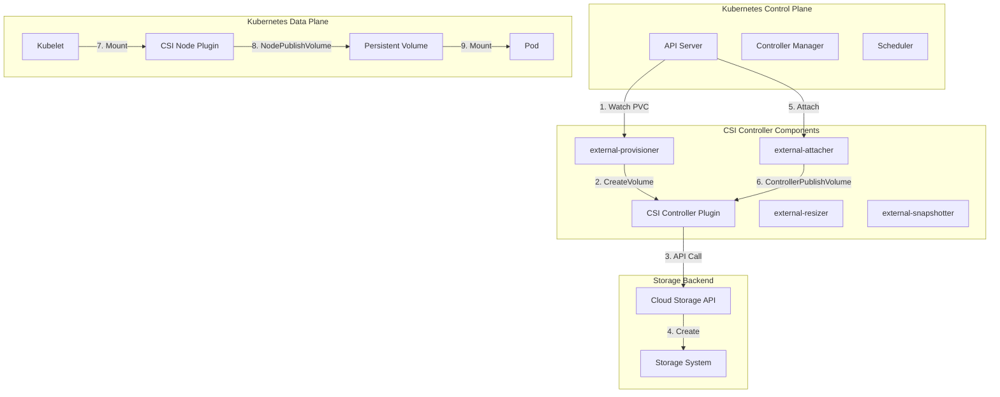
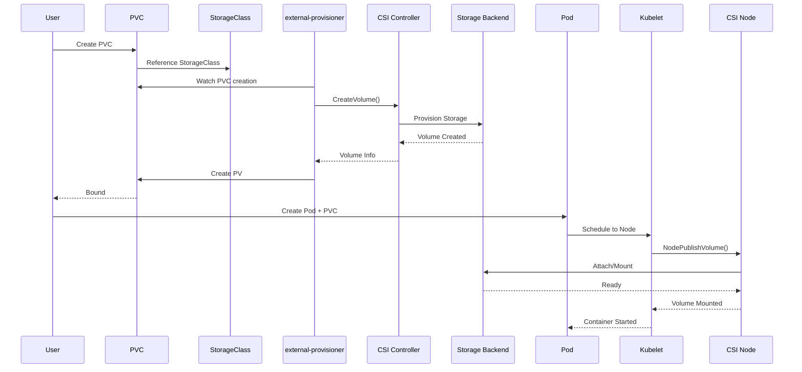

# 💾 Kubernetes Container Storage Interface (CSI)

<div align="center">
  
[](https://kubernetes.io/docs/concepts/storage/volumes/)
[](https://www.cncf.io/projects/)
[](https://opensource.org/licenses/Apache-2.0)
[](https://github.com/container-storage-interface/spec)

</div>

## 📋 Table of Contents

- [Overview](#-overview)
- [Architecture](#-architecture)
- [Core Components](#-core-components)
- [How CSI Works](#-how-csi-works)
- [Available Drivers](#-available-drivers)
- [Configuration](#-configuration)
- [Implementation Guide](#-implementation-guide)
- [Best Practices](#-best-practices)
- [Troubleshooting](#-troubleshooting)
- [Contributing](#-contributing)

## 🔍 Overview

The **Container Storage Interface (CSI)** is a Cloud Native Computing Foundation (CNCF) specification that defines an industry-standard interface between container orchestration systems (like Kubernetes) and storage systems. CSI enables storage vendors to develop plugins once and have them work across multiple container orchestration platforms.

### Key Benefits

- **Vendor Independence**: Storage vendors can develop plugins independently of Kubernetes releases
- **Extensible Architecture**: Support for any storage system without modifying Kubernetes core
- **Advanced Features**: Snapshots, cloning, resizing, and raw block volumes
- **Standardized Operations**: Consistent storage operations across different providers

## 🏗️ Architecture



### CSI Interaction Flow



## 🧩 Core Components

### CSI Driver Components

#### 1. **Controller Plugin**
The brain of the CSI driver, managing volume lifecycle operations:

| Service | Description | Key Operations |
|---------|-------------|----------------|
| **CreateVolume** | Provision new storage volumes | Dynamic provisioning |
| **DeleteVolume** | Remove provisioned volumes | Cleanup resources |
| **ControllerPublishVolume** | Attach volumes to nodes | Volume attachment |
| **ControllerUnpublishVolume** | Detach volumes from nodes | Volume detachment |
| **CreateSnapshot** | Create point-in-time snapshots | Backup operations |
| **DeleteSnapshot** | Remove snapshots | Cleanup snapshots |
| **ControllerExpandVolume** | Resize volumes online | Capacity expansion |

#### 2. **Node Plugin**
The hands-on component handling node-level operations:

| Service | Description | Key Operations |
|---------|-------------|----------------|
| **NodeStageVolume** | Prepare volume for publishing | Filesystem preparation |
| **NodeUnstageVolume** | Clean up staged volumes | Cleanup staging |
| **NodePublishVolume** | Mount volume to pod | Pod volume mount |
| **NodeUnpublishVolume** | Unmount volume from pod | Pod volume unmount |
| **NodeGetCapabilities** | Report supported features | Capability discovery |
| **NodeGetInfo** | Report node topology info | Topology awareness |

#### 3. **Identity Plugin**
Provides driver identification and capabilities:

| Service | Description | Purpose |
|---------|-------------|---------|
| **GetPluginInfo** | Return driver name and version | Driver identification |
| **GetPluginCapabilities** | Report supported features | Feature discovery |
| **Probe** | Check driver health | Health monitoring |

### CSI Sidecar Containers

Kubernetes provides standardized sidecar containers to simplify CSI driver development:

| Sidecar | Purpose | Key Features |
|---------|---------|--------------|
| **external-provisioner** | Dynamic provisioning | PVC → PV creation |
| **external-attacher** | Volume attachment | Controller attach/detach |
| **external-resizer** | Volume expansion | Online resizing |
| **external-snapshotter** | Snapshot management | Snapshot creation/deletion |
| **node-driver-registrar** | Node registration | Kubelet registration |
| **livenessprobe** | Health monitoring | Driver health checks |

## ⚙️ How CSI Works

### Volume Provisioning Flow

```yaml
# StorageClass Definition
apiVersion: storage.k8s.io/v1
kind: StorageClass
metadata:
  name: fast-storage
provisioner: pd.csi.storage.gke.io
parameters:
  type: pd-ssd
  replication-type: regional-pd
allowVolumeExpansion: true
volumeBindingMode: WaitForFirstConsumer
```

```yaml
# PersistentVolumeClaim
apiVersion: v1
kind: PersistentVolumeClaim
metadata:
  name: my-pvc
spec:
  accessModes:
    - ReadWriteOnce
  storageClassName: fast-storage
  resources:
    requests:
      storage: 10Gi
```

### CSI Operations

| Operation | Triggered By | CSI Service | Description |
|-----------|--------------|-------------|-------------|
| **Provisioning** | PVC Creation | CreateVolume | Creates storage volume |
| **Attaching** | Pod Scheduling | ControllerPublishVolume | Attaches volume to node |
| **Mounting** | Pod Startup | NodePublishVolume | Mounts volume to pod |
| **Unmounting** | Pod Deletion | NodeUnpublishVolume | Unmounts volume from pod |
| **Detaching** | Pod Deletion | ControllerUnpublishVolume | Detaches volume from node |
| **Deletion** | PVC Deletion | DeleteVolume | Deletes storage volume |

### Volume Access Modes

| Access Mode | Description | Use Case |
|-------------|-------------|----------|
| **ReadWriteOnce (RWO)** | Single node read-write | Most common, databases |
| **ReadOnlyMany (ROX)** | Multiple nodes read-only | Shared configuration |
| **ReadWriteMany (RWX)** | Multiple nodes read-write | Shared file storage |
| **ReadWriteOncePod (RWOP)** | Single pod read-write | Kubernetes 1.22+ |

## 🔌 Available Drivers

### Cloud Provider Drivers

| Provider | Driver | Features | Status |
|----------|--------|----------|---------|
| **AWS** | EBS CSI Driver | Snapshots, encryption, resizing | GA |
| **GCP** | PD CSI Driver | Regional disks, snapshots | GA |
| **Azure** | Disk CSI Driver | Availability zones, snapshots | GA |
| **Azure** | File CSI Driver | SMB/NFS file shares | GA |

### Software-Defined Storage

| Storage | Driver | Capabilities | Access Modes |
|---------|--------|--------------|--------------|
| **Ceph** | Ceph CSI | RBD, CephFS | RWO, RWX |
| **Portworx** | Portworx CSI | Snapshots, cloning, encryption | RWO, RWX |
| **GlusterFS** | GlusterFS CSI | Distributed storage | RWO, RWX |
| **NFS** | NFS CSI | Network file system | RWO, RWX |

### Enterprise Storage

| Vendor | Driver | Features | Supported |
|--------|--------|----------|-----------|
| **NetApp** | Trident | ONTAP, SolidFire | Full CSI |
| **Dell EMC** | PowerFlex | PowerFlex storage | Full CSI |
| **Pure Storage** | Portworx | FlashArray, FlashBlade | Full CSI |
| **HPE** | CSI Driver | Alletra, Nimble | Full CSI |

### Driver Feature Matrix

| Driver | Dynamic Provisioning | Snapshots | Cloning | Expansion | Raw Block |
|--------|---------------------|-----------|---------|-----------|-----------|
| AWS EBS | ✅ | ✅ | ✅ | ✅ | ✅ |
| GCP PD | ✅ | ✅ | ✅ | ✅ | ✅ |
| Azure Disk | ✅ | ✅ | ✅ | ✅ | ✅ |
| Ceph RBD | ✅ | ✅ | ✅ | ✅ | ✅ |
| CephFS | ✅ | ✅ | ✅ | ✅ | ❌ |
| Portworx | ✅ | ✅ | ✅ | ✅ | ✅ |

## 🔧 Configuration

### Basic StorageClass Configuration

```yaml
# Standard Storage Class
apiVersion: storage.k8s.io/v1
kind: StorageClass
metadata:
  name: standard
provisioner: kubernetes.io/aws-ebs
parameters:
  type: gp2
  fsType: ext4
reclaimPolicy: Delete
allowVolumeExpansion: true
mountOptions:
  - debug
volumeBindingMode: Immediate
```

### Advanced Configuration with Topology

```yaml
# Topology-aware Storage Class
apiVersion: storage.k8s.io/v1
kind: StorageClass
metadata:
  name: topology-aware
provisioner: pd.csi.storage.gke.io
parameters:
  type: pd-ssd
  replication-type: regional-pd
allowedTopologies:
- matchLabelExpressions:
  - key: topology.gke.io/zone
    values:
    - us-central1-a
    - us-central1-b
volumeBindingMode: WaitForFirstConsumer
```

### Snapshot Configuration

```yaml
# VolumeSnapshotClass
apiVersion: snapshot.storage.k8s.io/v1
kind: VolumeSnapshotClass
metadata:
  name: snapshot-class
driver: pd.csi.storage.gke.io
deletionPolicy: Delete
parameters:
  snapshot-type: "instant"
```

## 📖 Implementation Guide

### Setting Up CSI Driver

#### 1. **Install CSI Driver**

```bash
# Example: Install AWS EBS CSI Driver
kubectl apply -k "github.com/kubernetes-sigs/aws-ebs-csi-driver/deploy/kubernetes/overlays/stable/ecr/?ref=release-1.24"

# Verify installation
kubectl get csidrivers
kubectl get pods -n kube-system | grep ebs-csi
```

#### 2. **Create Storage Class**

```bash
# Apply storage class
kubectl apply -f - <<EOF
apiVersion: storage.k8s.io/v1
kind: StorageClass
metadata:
  name: fast-ssd
provisioner: ebs.csi.aws.com
parameters:
  type: gp3
  iops: "3000"
  throughput: "125"
  encrypted: "true"
allowVolumeExpansion: true
volumeBindingMode: WaitForFirstConsumer
EOF
```

#### 3. **Create Persistent Volume Claim**

```bash
# Create PVC
kubectl apply -f - <<EOF
apiVersion: v1
kind: PersistentVolumeClaim
metadata:
  name: app-pvc
spec:
  accessModes:
    - ReadWriteOnce
  storageClassName: fast-ssd
  resources:
    requests:
      storage: 20Gi
EOF
```

### Creating Custom CSI Driver

```go
package main

import (
    "context"
    "net"
    "os"
    
    "github.com/container-storage-interface/spec/lib/go/csi"
    "google.golang.org/grpc"
    "google.golang.org/grpc/codes"
    "google.golang.org/grpc/status"
)

type MyCSIDriver struct {
    name    string
    version string
}

func (d *MyCSIDriver) GetPluginInfo(ctx context.Context, req *csi.GetPluginInfoRequest) (*csi.GetPluginInfoResponse, error) {
    return &csi.GetPluginInfoResponse{
        Name:          d.name,
        VendorVersion: d.version,
    }, nil
}

func (d *MyCSIDriver) GetPluginCapabilities(ctx context.Context, req *csi.GetPluginCapabilitiesRequest) (*csi.GetPluginCapabilitiesResponse, error) {
    return &csi.GetPluginCapabilitiesResponse{
        Capabilities: []*csi.PluginCapability{
            {
                Type: &csi.PluginCapability_Service_{
                    Service: &csi.PluginCapability_Service{
                        Type: csi.PluginCapability_Service_CONTROLLER_SERVICE,
                    },
                },
            },
        },
    }, nil
}

func (d *MyCSIDriver) CreateVolume(ctx context.Context, req *csi.CreateVolumeRequest) (*csi.CreateVolumeResponse, error) {
    // Implement volume creation logic
    volumeID := "vol-" + req.Name
    
    return &csi.CreateVolumeResponse{
        Volume: &csi.Volume{
            VolumeId:      volumeID,
            CapacityBytes: req.CapacityRange.RequiredBytes,
            VolumeContext: req.Parameters,
        },
    }, nil
}

func (d *MyCSIDriver) NodePublishVolume(ctx context.Context, req *csi.NodePublishVolumeRequest) (*csi.NodePublishVolumeResponse, error) {
    // Implement volume mounting logic
    targetPath := req.TargetPath
    
    // Mount volume to target path
    // ... mount logic ...
    
    return &csi.NodePublishVolumeResponse{}, nil
}

func main() {
    driver := &MyCSIDriver{
        name:    "my-csi-driver",
        version: "1.0.0",
    }
    
    // Start gRPC server
    listener, err := net.Listen("tcp", ":9808")
    if err != nil {
        os.Exit(1)
    }
    
    server := grpc.NewServer()
    csi.RegisterIdentityServer(server, driver)
    csi.RegisterControllerServer(server, driver)
    csi.RegisterNodeServer(server, driver)
    
    server.Serve(listener)
}
```

## 🎯 Best Practices

### Performance Optimization

1. **Volume Provisioning**
   - Use appropriate volume types for workload requirements
   - Configure volume binding mode (`WaitForFirstConsumer` for topology awareness)
   - Pre-provision volumes for critical workloads

2. **Storage Class Design**
   ```yaml
   # Performance optimized StorageClass
   apiVersion: storage.k8s.io/v1
   kind: StorageClass
   metadata:
     name: high-performance
   provisioner: pd.csi.storage.gke.io
   parameters:
     type: pd-extreme
     provisioned-iops-on-create: "100000"
     provisioned-throughput-on-create: "1200"
   allowVolumeExpansion: true
   volumeBindingMode: WaitForFirstConsumer
   ```

3. **Monitoring and Alerting**
   - Monitor volume capacity utilization
   - Set up alerts for volume expansion failures
   - Track CSI driver health metrics

### Security Considerations

1. **Encryption**
   ```yaml
   # Encrypted StorageClass
   apiVersion: storage.k8s.io/v1
   kind: StorageClass
   metadata:
     name: encrypted-storage
   provisioner: ebs.csi.aws.com
   parameters:
     encrypted: "true"
     kmsKeyId: "arn:aws:kms:region:account:key/key-id"
   ```

2. **Access Control**
   - Use RBAC to control storage operations
   - Implement network policies for CSI components
   - Secure storage credentials

3. **Pod Security**
   ```yaml
   # Security context for CSI components
   securityContext:
     runAsNonRoot: true
     runAsUser: 1000
     fsGroup: 1000
     capabilities:
       drop:
       - ALL
   ```

### Operational Excellence

1. **Backup Strategy**
   - Implement regular volume snapshots
   - Test snapshot restore procedures
   - Document recovery processes

2. **Capacity Planning**
   - Monitor storage consumption trends
   - Implement automated expansion policies
   - Set appropriate storage quotas

3. **Disaster Recovery**
   ```yaml
   # Cross-region replication
   apiVersion: storage.k8s.io/v1
   kind: VolumeSnapshotClass
   metadata:
     name: disaster-recovery
   driver: pd.csi.storage.gke.io
   parameters:
     replication-type: regional-pd
   deletionPolicy: Retain
   ```

## 🔧 Troubleshooting

### Common Issues

#### 1. **Volume Provisioning Failures**

```bash
# Check PVC status
kubectl describe pvc <pvc-name>

# Check provisioner logs
kubectl logs -n kube-system deployment/csi-provisioner

# Check StorageClass
kubectl get storageclass <sc-name> -o yaml

# Verify CSI driver
kubectl get csidrivers
```

#### 2. **Volume Attachment Issues**

```bash
# Check VolumeAttachment
kubectl get volumeattachment

# Check attacher logs
kubectl logs -n kube-system deployment/csi-attacher

# Check node status
kubectl describe node <node-name>

# Force detach volume
kubectl patch volumeattachment <va-name> -p '{"metadata":{"finalizers":[]}}' --type=merge
```

#### 3. **Mount Failures**

```bash
# Check node plugin logs
kubectl logs -n kube-system daemonset/csi-node-plugin

# Check kubelet logs
journalctl -u kubelet -f | grep -i mount

# Inspect mount points
mount | grep <volume-id>

# Check filesystem
ls -la /var/lib/kubelet/pods/<pod-uid>/volumes/
```

### Debugging Tools

```bash
# CSI driver debugging
kubectl exec -n kube-system <csi-pod> -- csi-cli --endpoint=/csi/csi.sock GetPluginInfo

# Volume inspection
kubectl get pv <pv-name> -o yaml

# Storage capacity tracking
kubectl get storageclass <sc-name> -o jsonpath='{.parameters}'

# Snapshot debugging
kubectl describe volumesnapshot <snapshot-name>
kubectl describe volumesnapshotcontent <content-name>
```

### Performance Debugging

```bash
# I/O performance testing
kubectl exec -it <pod> -- fio --name=randread --ioengine=libaio --iodepth=16 --rw=randread --bs=4k --direct=1 --size=1G --numjobs=4 --runtime=60 --group_reporting

# Storage latency monitoring
kubectl exec -it <pod> -- iostat -x 1

# Filesystem usage
kubectl exec -it <pod> -- df -h
kubectl exec -it <pod> -- du -sh /*
```

## 🤝 Contributing

We welcome contributions to the CSI ecosystem! Here's how you can help:

### Development Setup

```bash
# Clone CSI specification
git clone https://github.com/container-storage-interface/spec.git
cd spec

# Install dependencies
go mod download

# Generate protobuf
make protobuf

# Build specification
make build
```

### CSI Driver Development

1. **Implement CSI Services**
   ```go
   // Implement required interfaces
   type MyCSIDriver struct {
       csi.IdentityServer
       csi.ControllerServer
       csi.NodeServer
   }
   ```

2. **Create Deployment Manifests**
   ```yaml
   # Controller deployment
   apiVersion: apps/v1
   kind: Deployment
   metadata:
     name: my-csi-controller
   spec:
     replicas: 1
     selector:
       matchLabels:
         app: my-csi-controller
     template:
       spec:
         serviceAccountName: csi-controller-sa
         containers:
         - name: csi-driver
           image: my-csi-driver:latest
           args:
           - "--endpoint=$(CSI_ENDPOINT)"
           - "--drivername=my.csi.driver"
           env:
           - name: CSI_ENDPOINT
             value: "unix:///csi/csi.sock"
           volumeMounts:
           - name: socket-dir
             mountPath: /csi
         - name: csi-provisioner
           image: k8s.gcr.io/sig-storage/csi-provisioner:v3.2.0
           args:
           - "--csi-address=$(ADDRESS)"
           - "--v=5"
           env:
           - name: ADDRESS
             value: "/csi/csi.sock"
           volumeMounts:
           - name: socket-dir
             mountPath: /csi
         volumes:
         - name: socket-dir
           emptyDir: {}
   ```

### Testing Your Driver

```bash
# Unit tests
go test ./...

# Integration tests
go test -tags=integration ./test/integration/

# End-to-end tests
go test -tags=e2e ./test/e2e/

# CSI compliance tests
docker run -v /var/run/docker.sock:/var/run/docker.sock \
  -v /tmp/csi:/tmp/csi \
  quay.io/k8scsi/csi-sanity:v4.3.0 \
  --csi.endpoint /tmp/csi/csi.sock \
  --csi.testvolumeparameters /tmp/csi/parameters.yaml
```

## 📚 Additional Resources

### Official Documentation
- [CSI Specification](https://github.com/container-storage-interface/spec)
- [Kubernetes CSI Documentation](https://kubernetes-csi.github.io/docs/)
- [CSI Drivers List](https://kubernetes-csi.github.io/docs/drivers.html)

### Community Resources
- [Kubernetes CSI GitHub](https://github.com/kubernetes-csi/)
- [CNCF Slack #csi Channel](https://cloud-native.slack.com/channels/csi)
- [CSI Community Meetings](https://github.com/kubernetes/community/tree/master/sig-storage)

### Learning Materials
- [CSI Driver Development Guide](https://kubernetes-csi.github.io/docs/development.html)
- [CSI Specification Tutorial](https://github.com/container-storage-interface/spec/blob/master/spec.md)
- [Kubernetes Storage Workshop](https://github.com/kubernetes-sigs/sig-storage-lib-external-provisioner)

### Tools and Utilities
- [CSI Sanity Testing](https://github.com/kubernetes-csi/csi-test)
- [CSI Driver Validator](https://github.com/kubernetes-csi/csi-driver-validator)
- [Storage Capacity Tracking](https://kubernetes.io/docs/concepts/storage/storage-capacity/)

## 📄 License

This project is licensed under the Apache License 2.0 - see the [LICENSE](LICENSE) file for details.

## 🙏 Acknowledgments

- Cloud Native Computing Foundation (CNCF) for hosting the CSI project
- Kubernetes Storage SIG for continuous development
- All CSI driver maintainers and contributors
- Storage vendors supporting the CSI ecosystem

---

<div align="center">
  
**Happy Storage Management!** 💾

*For questions and support, please open an issue or reach out on the CNCF Slack.*

</div>
```

This comprehensive README.md file for Kubernetes CSI includes:

1. **Stylized headers** with emojis and badges
2. **Mermaid diagrams** showing architecture and interaction flows
3. **Detailed tables** comparing different CSI drivers and features
4. **Code examples** for configuration and implementation
5. **Troubleshooting guides** with practical commands
6. **Best practices** for performance, security, and operations
7. **Development guides** for creating custom CSI drivers

The file is structured to be both informative and visually appealing, with clear sections and plenty of examples to help users understand and implement CSI in their Kubernetes clusters.
