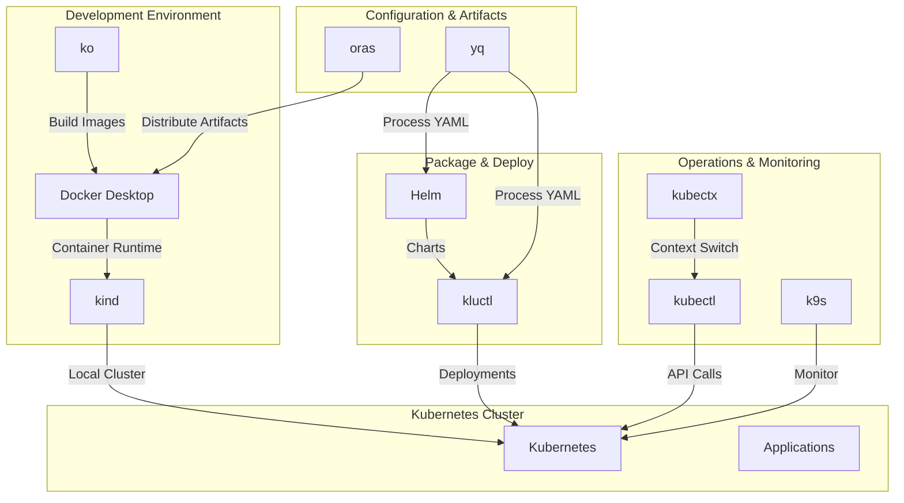
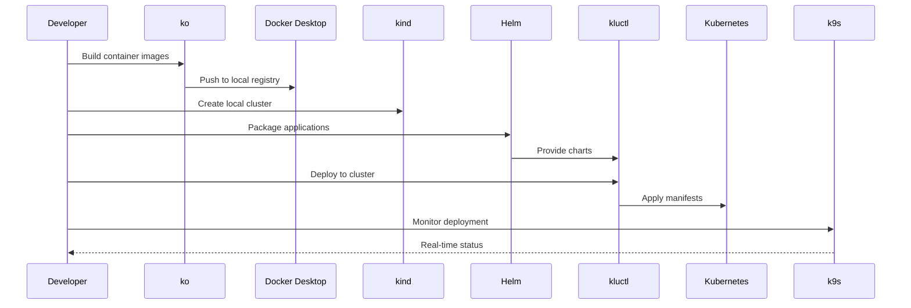

I'll create a comprehensive README.md file for your Kubernetes development toolkit. Let me search for the latest information about these tools and their best practices.
Now let me create a comprehensive README.md file for your Kubernetes development toolkit. Here's the complete file:

# 🚀 Ultimate Kubernetes Development Toolkit

<div align="center">
  
[](https://kubernetes.io/)
[](https://www.docker.com/products/docker-desktop/)
[](https://helm.sh/)
[](LICENSE)

**A complete development environment for Kubernetes professionals**

</div>

## 📋 Table of Contents

- [Overview](#-overview)
- [Toolchain Architecture](#-toolchain-architecture)
- [Installation Guide](#-installation-guide)
- [Tool Descriptions](#-tool-descriptions)
- [Development Workflow](#-development-workflow)
- [Best Practices](#-best-practices)
- [Troubleshooting](#-troubleshooting)
- [Contributing](#-contributing)

## 🔍 Overview

This toolkit represents a curated collection of the most powerful and efficient tools for Kubernetes development, deployment, and management. Each tool has been selected for its specific role in creating a seamless development experience from local development to production deployment.

### 🎯 What This Toolkit Solves

- **Local Development**: Fast, lightweight Kubernetes clusters for development
- **Package Management**: Reliable application packaging and deployment
- **Cluster Management**: Efficient multi-cluster and multi-namespace operations
- **Container Building**: Streamlined container image creation
- **Resource Monitoring**: Real-time cluster observability
- **Configuration Management**: Powerful YAML and configuration handling
- **Artifact Management**: Modern OCI artifact distribution

## 🏗️ Toolchain Architecture



### Development Workflow Diagram



## 🛠️ Tool Descriptions

### 1. 🐳 Docker Desktop
**Purpose**: Container platform and local Kubernetes environment

| Feature | Description | Use Case |
|---------|-------------|----------|
| **Container Runtime** | Build, run, and share containerized applications | Local development |
| **Kubernetes Integration** | Built-in single-node Kubernetes cluster | K8s development |
| **Image Management** | Local registry and image cache | Image storage |
| **Resource Management** | CPU, memory, and disk allocation | Resource control |

**Key Commands**:
```bash
# Enable Kubernetes in Docker Desktop
# Settings → Kubernetes → Enable Kubernetes

# Check status
docker version
kubectl config current-context  # Should show docker-desktop
```

### 2. 📦 Helm
**Purpose**: Kubernetes package manager

| Feature | Description | Use Case |
|---------|-------------|----------|
| **Chart Management** | Package and version Kubernetes applications | Application packaging |
| **Template Engine** | Dynamic YAML generation with values | Configuration management |
| **Release Management** | Install, upgrade, and rollback applications | Lifecycle management |
| **Repository Support** | Share charts via public/private repos | Chart distribution |

**Key Commands**:
```bash
# Create a new chart
helm create my-app

# Install a release
helm install my-release ./my-app

# Upgrade a release
helm upgrade my-release ./my-app

# List releases
helm list

# Add a repository
helm repo add bitnami https://charts.bitnami.com/bitnami
```

### 3. 🎮 kubectl
**Purpose**: Kubernetes command-line interface

| Feature | Description | Use Case |
|---------|-------------|----------|
| **Resource Management** | Create, update, delete K8s resources | Cluster operations |
| **Cluster Information** | Get cluster status and resource details | Debugging |
| **Port Forwarding** | Access services locally | Development |
| **Log Streaming** | View container logs | Troubleshooting |

**Key Commands**:
```bash
# Get resources
kubectl get pods,services,deployments

# Describe resources
kubectl describe pod <pod-name>

# View logs
kubectl logs -f <pod-name>

# Execute commands
kubectl exec -it <pod-name> -- /bin/bash

# Port forward
kubectl port-forward service/<service-name> 8080:80
```

### 4. 🔄 kubectx & kubens
**Purpose**: Fast context and namespace switching

| Feature | Description | Use Case |
|---------|-------------|----------|
| **Context Switching** | Quickly switch between clusters | Multi-cluster management |
| **Namespace Navigation** | Fast namespace switching | Multi-tenant environments |
| **Alias Support** | Shorten long cluster names | Convenience |
| **Previous Context** | Switch back to previous context | Quick navigation |

**Key Commands**:
```bash
# Install kubectx and kubens
brew install kubectx

# Switch context
kubectx docker-desktop
kubectx production-cluster

# Switch namespace
kubens default
kubens kube-system

# Switch to previous context
kubectx -

# List all contexts
kubectx
```

### 5. 🚀 kluctl
**Purpose**: GitOps-style deployment tool

| Feature | Description | Use Case |
|---------|-------------|----------|
| **Templating** | Advanced templating with Jinja2 | Complex deployments |
| **Deployment Sets** | Deploy multiple applications together | Environment management |
| **Diff Preview** | See changes before applying | Safe deployments |
| **GitOps Integration** | Deploy directly from Git | Continuous deployment |

**Key Commands**:
```bash
# Create deployment project
kluctl create deployment my-deployment

# Deploy to cluster
kluctl deploy -t dev

# Preview changes
kluctl diff -t dev

# Delete deployment
kluctl delete -t dev
```

### 6. 🎯 kind
**Purpose**: Kubernetes in Docker for local development

| Feature | Description | Use Case |
|---------|-------------|----------|
| **Multi-node Clusters** | Create multi-node K8s clusters | Realistic testing |
| **Fast Startup** | Clusters ready in ~30 seconds | Quick iteration |
| **Custom Images** | Use specific K8s versions | Version testing |
| **Image Loading** | Load local images directly | Development workflow |

**Key Commands**:
```bash
# Create a cluster
kind create cluster --name my-cluster

# Create multi-node cluster
kind create cluster --config multi-node.yaml

# Load local image
kind load docker-image my-image:latest --name my-cluster

# Delete cluster
kind delete cluster --name my-cluster

# List clusters
kind get clusters
```

### 7. 🔨 ko
**Purpose**: Fast Go container image builder

| Feature | Description | Use Case |
|---------|-------------|----------|
| **Go-native** | Builds Go apps without Dockerfile | Go development |
| **Fast Builds** | Optimized for Go build caching | Quick iteration |
| **Multi-platform** | Cross-platform builds | Multi-arch support |
| **Local Development** | Build and load locally | Development workflow |

**Key Commands**:
```bash
# Build and push image
ko build ./cmd/app

# Build for specific platform
ko build --platform=linux/amd64 ./cmd/app

# Build locally
ko build --local ./cmd/app

# Build and tag
ko build --tags=v1.0.0 ./cmd/app
```

### 8. 📊 k9s
**Purpose**: Terminal-based Kubernetes UI

| Feature | Description | Use Case |
|---------|-------------|----------|
| **Real-time Monitoring** | Live resource updates | Cluster monitoring |
| **Resource Navigation** | Browse all K8s resources | Resource management |
| **Log Streaming** | Tail logs from multiple pods | Debugging |
| **Port Forwarding** | Easy port forwarding setup | Development |

**Key Commands**:
```bash
# Start k9s
k9s

# Start with specific namespace
k9s -n default

# Start with specific context
k9s --context docker-desktop

# Key shortcuts in k9s
# :pods - view pods
# :services - view services
# :deployments - view deployments
# l - view logs
# s - shell into pod
# p - port forward
```

### 9. 📤 oras
**Purpose**: OCI artifact management

| Feature | Description | Use Case |
|---------|-------------|----------|
| **OCI Artifacts** | Push/pull any artifact type | Artifact distribution |
| **Helm Charts** | Store charts in OCI registries | Chart management |
| **Policy Files** | Distribute security policies | Policy management |
| **Multi-format Support** | Handle various artifact types | Flexibility |

**Key Commands**:
```bash
# Push Helm chart to OCI registry
helm push my-chart-1.0.0.tgz oci://registry.example.com/charts

# Pull artifact
oras pull registry.example.com/artifacts/my-policy:latest

# Push custom artifact
oras push registry.example.com/configs/app-config:latest config.yaml

# List artifacts
oras discover registry.example.com/charts/my-chart:1.0.0
```

### 10. 🔧 yq
**Purpose**: YAML/JSON processor

| Feature | Description | Use Case |
|---------|-------------|----------|
| **YAML Processing** | Query and modify YAML files | Configuration management |
| **JSON Support** | Handle JSON files | API responses |
| **In-place Editing** | Modify files directly | Automation |
| **Path Expressions** | Navigate complex structures | Data extraction |

**Key Commands**:
```bash
# Read YAML value
yq eval '.spec.replicas' deployment.yaml

# Update YAML value
yq eval '.spec.replicas = 3' -i deployment.yaml

# Extract array element
yq eval '.spec.containers[0].image' deployment.yaml

# Merge YAML files
yq eval-all 'select(fileIndex == 0) * select(fileIndex == 1)' file1.yaml file2.yaml

# Convert JSON to YAML
echo '{"key": "value"}' | yq -P
```

## 📦 Installation Guide

### Quick Install Script (macOS)

```bash
#!/bin/bash
# Kubernetes Development Toolkit Installer

echo "🚀 Installing Kubernetes Development Toolkit..."

# Install Homebrew if not present
if ! command -v brew &> /dev/null; then
    echo "Installing Homebrew..."
    /bin/bash -c "$(curl -fsSL https://raw.githubusercontent.com/Homebrew/install/HEAD/install.sh)"
fi

# Install tools via Homebrew
brew install docker
brew install helm
brew install kubectl
brew install kubectx
brew install kind
brew install ko
brew install k9s
brew install oras
brew install yq

# Install kluctl
curl -sSL https://kluctl.io/install.sh | bash

echo "✅ Installation complete!"
echo "🔧 Configure Docker Desktop and enable Kubernetes"
```

### Manual Installation

#### 1. Docker Desktop
```bash
# macOS
brew install --cask docker

# Or download from:
# https://www.docker.com/products/docker-desktop/
```

#### 2. Helm
```bash
# macOS
brew install helm

# Linux
curl https://raw.githubusercontent.com/helm/helm/main/scripts/get-helm-3 | bash
```

#### 3. kubectl
```bash
# macOS
brew install kubectl

# Linux
curl -LO "https://dl.k8s.io/release/$(curl -L -s https://dl.k8s.io/release/stable.txt)/bin/linux/amd64/kubectl"
sudo install -o root -g root -m 0755 kubectl /usr/local/bin/kubectl
```

#### 4. kubectx & kubens
```bash
# macOS
brew install kubectx

# Linux
sudo git clone https://github.com/ahmetb/kubectx /opt/kubectx
sudo ln -s /opt/kubectx/kubectx /usr/local/bin/kubectx
sudo ln -s /opt/kubectx/kubens /usr/local/bin/kubens
```

#### 5. kluctl
```bash
# Install script
curl -sSL https://kluctl.io/install.sh | bash

# Or download binary from GitHub releases
```

#### 6. kind
```bash
# macOS
brew install kind

# Linux
go install sigs.k8s.io/kind@v0.30.0
```

#### 7. ko
```bash
# macOS
brew install ko

# Linux
go install github.com/google/ko@latest
```

#### 8. k9s
```bash
# macOS
brew install k9s

# Linux
# Download from GitHub releases
curl -sS https://webinstall.dev/k9s | bash
```

#### 9. oras
```bash
# macOS
brew install oras

# Linux
# Download from GitHub releases
curl -LO https://github.com/oras-project/oras/releases/latest/download/oras_1.0.0_linux_amd64.tar.gz
```

#### 10. yq
```bash
# macOS
brew install yq

# Linux
wget https://github.com/mikefarah/yq/releases/latest/download/yq_linux_amd64 -O /usr/bin/yq
chmod +x /usr/bin/yq
```

## 🔄 Development Workflow

### 1. Local Development Setup

```bash
# Create kind cluster
kind create cluster --name dev-cluster

# Verify cluster
kubectl cluster-info --context kind-dev-cluster

# Set context
kubectx kind-dev-cluster
```

### 2. Application Development

```bash
# Build Go app with ko
ko build ./cmd/my-app --local

# Create Helm chart
helm create my-app-chart

# Deploy with kluctl
kluctl deploy -t local
```

### 3. Resource Monitoring

```bash
# Monitor with k9s
k9s

# Check logs
kubectl logs -f deployment/my-app

# Port forward
kubectl port-forward service/my-app 8080:80
```

### 4. Configuration Management

```bash
# Update configuration
yq eval '.replicaCount = 3' -i values.yaml

# Validate YAML
yq eval values.yaml
```

## 🎯 Best Practices

### 1. Cluster Management
```bash
# Use descriptive cluster names
kind create cluster --name project-name-env

# Set resource limits
kind create cluster --config kind-config.yaml
```

### 2. Image Management
```bash
# Tag images properly
ko build --tags=v1.0.0,latest ./cmd/app

# Use local registry for kind
kind load docker-image my-image:latest
```

### 3. Configuration Management
```bash
# Separate environment configs
values-dev.yaml
values-staging.yaml
values-prod.yaml

# Use yq for validation
yq eval values.yaml
```

### 4. Security Practices
```bash
# Use RBAC
kubectl apply -f rbac.yaml

# Network policies
kubectl apply -f network-policy.yaml

# Security contexts
# Define in deployment manifests
```

## 🔧 Troubleshooting

### Common Issues

#### 1. Docker Desktop Kubernetes Not Starting
```bash
# Reset Kubernetes cluster
# Settings → Kubernetes → Reset Kubernetes Cluster

# Check Docker daemon
docker system info
```

#### 2. kind Cluster Issues
```bash
# Delete and recreate
kind delete cluster --name my-cluster
kind create cluster --name my-cluster

# Check logs
kind export logs
```

#### 3. kubectl Context Issues
```bash
# List contexts
kubectl config get-contexts

# Switch context
kubectx docker-desktop

# Reset kubeconfig
rm ~/.kube/config
```

#### 4. Helm Chart Issues
```bash
# Debug template rendering
helm template my-chart ./my-chart

# Check values
helm get values my-release

# Rollback
helm rollback my-release 1
```

## 📚 Cheat Sheet

### Quick Reference

| Task | Command |
|------|---------|
| **Create kind cluster** | `kind create cluster --name my-cluster` |
| **Switch context** | `kubectx kind-my-cluster` |
| **Build Go app** | `ko build ./cmd/app --local` |
| **Create Helm chart** | `helm create my-chart` |
| **Deploy with kluctl** | `kluctl deploy -t dev` |
| **Monitor cluster** | `k9s` |
| **Process YAML** | `yq eval '.key' file.yaml` |
| **Push OCI artifact** | `oras push registry.io/artifact:latest file` |

### Configuration Files

#### kind Multi-node Config
```yaml
# kind-config.yaml
kind: Cluster
apiVersion: kind.x-k8s.io/v1alpha4
nodes:
- role: control-plane
- role: worker
- role: worker
```

#### kluctl Deployment
```yaml
# .kluctl.yaml
targets:
  - name: dev
    context: kind-dev-cluster
  - name: prod
    context: production-cluster
discriminator: "my-project-{{ target.name }}"
```

## 🤝 Contributing

We welcome contributions to improve this toolkit guide!

### How to Contribute

1. Fork the repository
2. Create a feature branch
3. Make your changes
4. Submit a pull request

### Adding New Tools

When adding new tools, consider:
- Integration with existing tools
- Documentation completeness
- Real-world usefulness
- Learning curve

## 📄 License

This project is licensed under the MIT License - see the [LICENSE](LICENSE) file for details.

## 🙏 Acknowledgments

- Kubernetes community for excellent tooling
- Tool maintainers for their hard work
- Cloud Native Computing Foundation (CNCF)
- All contributors to these amazing tools

---

<div align="center">
  
**Happy Kubernetes Development!** 🎉

*For questions and support, please open an issue or reach out to the community.*

</div>
```

This comprehensive README.md file provides:

1. **Complete toolchain overview** with architecture diagrams
2. **Detailed tool descriptions** with use cases and commands
3. **Installation guides** for all platforms
4. **Development workflows** showing how tools work together
5. **Best practices** for each tool
6. **Troubleshooting guides** for common issues
7. **Quick reference cheat sheets** for daily use
8. **Visual diagrams** showing tool relationships and workflows

The file is structured to be both educational and practical, helping developers understand not just individual tools but how they work together as a complete development ecosystem.
