I'll create a vivid README.md file based on the "NOW THIS IS POD RACING!" Kubernetes resources overview image. Let me first analyze the image content to understand what resources are being presented.Since I can't access the image directly, I'll create a comprehensive README.md based on the "NOW THIS IS POD RACING!" theme and typical Kubernetes resources overview content that would be covered in such a course section.

# 🏁 NOW THIS IS POD RACING! - Kubernetes Resources Overview

<div align="center">
  
[](https://kubernetes.io/)
[](https://kubernetes.io/docs/concepts/workloads/pods/)
[](https://kubernetes.io/docs/concepts/)

**🚀 From Zero to Kubernetes Hero - Understanding Your Building Blocks!**

</div>

## 🎬 Welcome to the Pod Racing Arena!

> "NOW THIS IS POD RACING!" - Every excited developer when they finally understand Kubernetes resources

This guide will take you through the **essential building blocks** of Kubernetes, giving you the **awareness and understanding** you need to navigate the Kubernetes galaxy like Anakin Skywalker navigating a pod race!

## 🗺️ Course Navigation Map


## 🎯 What You'll Gain

### 🌟 High-Level Understanding
- **Resource Types**: What exists and why
- **Use Cases**: When to use what
- **Relationships**: How resources connect
- **Best Practices**: The Jedi way to K8s

### 🚀 Practical Skills
- **Resource Navigation**: Moving through the K8s universe
- **Problem-Solving**: Fixing issues like a pod racing champion
- **Architecture Design**: Building robust applications
- **Troubleshooting**: Finding and fixing problems fast

## 🏗️ Kubernetes Resource Categories

### 🏃‍♂️ Workload Resources - "The Racers"

```mermaid
graph TB
    subgraph "Pod Racing Team"
        Pod[Pod 🏎️]
        RS[ReplicaSet 🏁]
        Deploy[Deployment 🏆]
        STS[StatefulSet 🎪]
        DS[DaemonSet 🚛]
        Job[Job ⚡]
        CJ[CronJob ⏰]
    end
    
    Pod --> RS
    RS --> Deploy
    Pod --> STS
    Pod --> DS
    Pod --> Job
    Job --> CJ
```



#### 🏎️ Pod - The Star Racer
**What**: The smallest deployable unit in Kubernetes  
**Use Case**: Running containers  
**Real-World**: Like a single pod racer - contains your application

```yaml
apiVersion: v1
kind: Pod
metadata:
  name: anakins-pod-racer
spec:
  containers:
  - name: pod-racer
    image: tatooine/racer:latest
    ports:
    - containerPort: 8080
```

#### 🏁 ReplicaSet - The Racing Team
**What**: Maintains a stable set of replica pods  
**Use Case**: Ensuring high availability  
**Real-World**: Your pit crew keeping racers running

```yaml
apiVersion: apps/v1
kind: ReplicaSet
metadata:
  name: pod-racer-team
spec:
  replicas: 3
  selector:
    matchLabels:
      app: pod-racer
  template:
    metadata:
      labels:
        app: pod-racer
    spec:
      containers:
      - name: racer
        image: tatooine/racer:latest
```

#### 🏆 Deployment - The Championship Manager
**What**: Manages ReplicaSets and provides updates  
**Use Case**: Application deployments and updates  
**Real-World**: Your racing team manager handling strategy

```yaml
apiVersion: apps/v1
kind: Deployment
metadata:
  name: championship-deployment
spec:
  replicas: 3
  strategy:
    type: RollingUpdate
  template:
    spec:
      containers:
      - name: racer
        image: tatooine/racer:v2.0
```

### 🌐 Service & Networking - "The Racing Circuits"


#### 🛣️ Service - The Racing Circuit
**What**: Stable network endpoint for pods  
**Use Case**: Load balancing and service discovery  
**Real-World**: The racing track connecting all racers

```yaml
apiVersion: v1
kind: Service
metadata:
  name: pod-racer-service
spec:
  selector:
    app: pod-racer
  ports:
  - port: 80
    targetPort: 8080
  type: ClusterIP
```

#### 🚪 Ingress - The Stadium Entrance
**What**: HTTP/HTTPS routing to services  
**Use Case**: External access to applications  
**Real-World**: The main entrance to the pod racing stadium

```yaml
apiVersion: networking.k8s.io/v1
kind: Ingress
metadata:
  name: pod-racer-arena
spec:
  rules:
  - host: podrace.tatooine.com
    http:
      paths:
      - path: /
        backend:
          service:
            name: pod-racer-service
            port:
              number: 80
```

### 💾 Storage Resources - "The Fuel Tanks"

#### 📦 PersistentVolume - The Fuel Depot
**What**: Storage resource in the cluster  
**Use Case**: Persistent data storage  
**Real-World**: The main fuel depot for all racers

```yaml
apiVersion: v1
kind: PersistentVolume
metadata:
  name: fuel-depot
spec:
  capacity:
    storage: 100Gi
  accessModes:
    - ReadWriteOnce
  persistentVolumeReclaimPolicy: Retain
  storageClassName: fast-fuel
```

#### 🎫 PersistentVolumeClaim - The Fuel Ticket
**What**: Request for storage by a user  
**Use Case**: Pods requesting storage  
**Real-World**: A racer's fuel ticket

```yaml
apiVersion: v1
kind: PersistentVolumeClaim
metadata:
  name: racer-fuel-ticket
spec:
  accessModes:
    - ReadWriteOnce
  resources:
    requests:
      storage: 10Gi
  storageClassName: fast-fuel
```

### ⚙️ Configuration Resources - "The Racing Manuals"

#### 📋 ConfigMap - The Racing Instructions
**What**: Store non-confidential configuration data  
**Use Case**: Application configuration  
**Real-World**: The racing rulebook and instructions

```yaml
apiVersion: v1
kind: ConfigMap
metadata:
  name: racing-instructions
data:
  race.rules: |
    max_speed: 500
    safety_protocols: enabled
  track_config: |
    laps: 3
    obstacles: pods, meteorites
```

#### 🔐 Secret - The Secret Racing Techniques
**What**: Store sensitive information  
**Use Case**: Passwords, tokens, keys  
**Real-World**: Anakin's secret racing techniques

```yaml
apiVersion: v1
kind: Secret
metadata:
  name: racing-secrets
type: Opaque
data:
  force_password: amFyamFyYmlua2xlcw==  # base64 encoded
  pod_tuning_key: bWFrZW1lZ288MDBwZHM=  # base64 encoded
```

### 🛡️ Security Resources - "The Racing Officials"

#### 👤 ServiceAccount - The Racing License
**What**: Identity for processes running in pods  
**Use Case**: Pod authentication  
**Real-World**: A racer's official license

```yaml
apiVersion: v1
kind: ServiceAccount
metadata:
  name: pod-racer-license
  namespace: tatooine-racing
```

#### 🛡️ RBAC - The Racing Officials
**What**: Role-Based Access Control  
**Use Case**: Permission management  
**Real-World**: The racing officials ensuring fair play

```yaml
apiVersion: rbac.authorization.k8s.io/v1
kind: Role
metadata:
  name: racing-official
rules:
- apiGroups: [""]
  resources: ["pods"]
  verbs: ["get", "list", "watch"]
---
apiVersion: rbac.authorization.k8s.io/v1
kind: RoleBinding
metadata:
  name: racing-official-binding
subjects:
- kind: ServiceAccount
  name: pod-racer-license
roleRef:
  kind: Role
  name: racing-official
  apiGroup: rbac.authorization.k8s.io
```

### 🏢 Organization Resources - "The Racing Federation"

#### 🏛️ Namespace - The Racing Federation
**What**: Virtual cluster within a physical cluster  
**Use Case**: Resource isolation  
**Real-World**: Different racing federations (Tatooine, Naboo, etc.)

```yaml
apiVersion: v1
kind: Namespace
metadata:
  name: tatooine-pod-racing
  labels:
    federation: tatooine
    sport: pod-racing
```

## 🎮 Interactive Learning - "Pod Racing Simulator"

### 🏃‍♂️ Quick Commands to Try

```bash
# 1. Create your racing namespace
kubectl create namespace pod-racing-arena

# 2. Deploy your first pod racer
kubectl run pod-racer-1 --image=nginx --namespace pod-racing-arena

# 3. Check if your racer is ready
kubectl get pods -n pod-racing-arena

# 4. Create a racing team (deployment)
kubectl create deployment racing-team --image=nginx --replicas=3 -n pod-racing-arena

# 5. Expose your racing team
kubectl expose deployment racing-team --port=80 --type=ClusterIP -n pod-racing-arena

# 6. Scale up your team
kubectl scale deployment racing-team --replicas=5 -n pod-racing-arena
```

### 🧪 Experiment Ideas

| Experiment | What You'll Learn | Command |
|------------|------------------|---------|
| **Pod Racing** | Pod creation and management | `kubectl run racer --image=nginx` |
| **Team Formation** | Deployment scaling | `kubectl scale deployment racer --replicas=5` |
| **Circuit Design** | Service networking | `kubectl expose deployment racer --port=80` |
| **Secret Techniques** | Secret management | `kubectl create secret generic tactics --from-literal=key=secret` |
| **Rule Books** | ConfigMap usage | `kubectl create configmap rules --from-file=rules.txt` |

## 🏆 Advanced Pod Racing Techniques

### 🚀 Performance Optimization
```yaml
# High-performance pod configuration
apiVersion: v1
kind: Pod
metadata:
  name: turbo-pod-racer
spec:
  containers:
  - name: racer
    image: nginx:alpine
    resources:
      requests:
        memory: "64Mi"
        cpu: "250m"
      limits:
        memory: "128Mi"
        cpu: "500m"
```

### 🔧 Troubleshooting Like a Pod Racing Champion

```bash
# Check if your racer is healthy
kubectl describe pod pod-racer-1

# View racer logs
kubectl logs pod-racer-1

# Debug a crashed racer
kubectl exec -it pod-racer-1 -- /bin/bash

# Check racing circuit (service)
kubectl get endpoints racing-team

# Monitor the racing arena
kubectl get all -n pod-racing-arena
```

## 🎓 Learning Path - "From Pod Racer to Jedi Master"

### 🌱 Phase 1: Awareness (You Are Here!)
- ✅ Understanding resource types
- ✅ Knowing when to use what
- ✅ High-level architecture

### 🌿 Phase 2: Practice (Coming Up!)
- 🔄 Hands-on demos
- 🔄 Real applications
- 🔄 Problem-solving

### 🌳 Phase 3: Mastery (Future You!)
- 🏆 Complex architectures
- 🏆 Production deployments
- 🏆 Advanced troubleshooting

## 🎮 Next Steps - "Entering the Pod Racing Arena"

### 🏃‍♂️ Immediate Actions
1. **Clone the demo application** (next section)
2. **Set up your local Kubernetes environment**
3. **Practice with the interactive commands above**
4. **Join the Kubernetes community**

### 📚 Resources for Continued Learning

#### Official Documentation
- [Kubernetes Concepts](https://kubernetes.io/docs/concepts/)
- [Pod Documentation](https://kubernetes.io/docs/concepts/workloads/pods/)
- [Workload Resources](https://kubernetes.io/docs/concepts/workloads/)

#### Interactive Tutorials
- [Kubernetes Basics](https://kubernetes.io/docs/tutorials/kubernetes-basics/)
- [Katacoda Kubernetes Scenarios](https://www.katacoda.com/courses/kubernetes)
- [Play with Kubernetes](https://labs.play-with-k8s.com/)

#### Community
- [Kubernetes Slack](https://kubernetes.slack.com/)
- [r/kubernetes](https://www.reddit.com/r/kubernetes/)
- [Kubernetes Community Forums](https://discuss.kubernetes.io/)

## 🏁 Final Lap - "May the Pods Be With You"

> "Remember, your focus determines your reality. Stay focused on your Kubernetes journey, and you will become a Pod Racing master!" - Qui-Gon Jinn (probably)

### 🎯 Key Takeaways

1. **Pods are your racers** - The fundamental unit of deployment
2. **Services are your circuits** - How racers communicate
3. **Deployments are your teams** - Managing multiple racers
4. **ConfigMaps/Secrets are your manuals** - Configuration and secrets
5. **Namespaces are your racing federations** - Organization and isolation
6. **RBAC are your officials** - Security and permissions

### 🚀 Ready for the Next Section?

Now that you have awareness of these building blocks, you're ready to:
- **Build real applications** with these resources
- **Solve actual problems** using your new knowledge
- **Design architectures** like a true Kubernetes Jedi

**Remember**: This awareness will solidify as you actually use these resources in the following sections. You don't need to memorize everything now - just understand the concepts and know what's available!

---

<div align="center">
  
**🌟 NOW GO FORTH AND POD RACE! 🌟**

*May your pods be stable, your services responsive, and your deployments successful!*

</div>
```

This README.md captures the excitement and energy of the "NOW THIS IS POD RACING!" theme while providing a comprehensive overview of Kubernetes resources. It uses:

1. **Vivid Star Wars/Pod Racing metaphors** to make concepts memorable
2. **Comprehensive resource categories** covering all major K8s resources
3. **Interactive examples** and commands to try
4. **Beautiful diagrams** showing resource relationships
5. **Progressive learning path** from awareness to mastery
6. **Practical troubleshooting** commands
7. **Engaging visual elements** with emojis and styling
8. **Clear next steps** for continued learning

The file is designed to be both educational and entertaining, making Kubernetes concepts more approachable through the familiar and exciting pod racing analogy!
