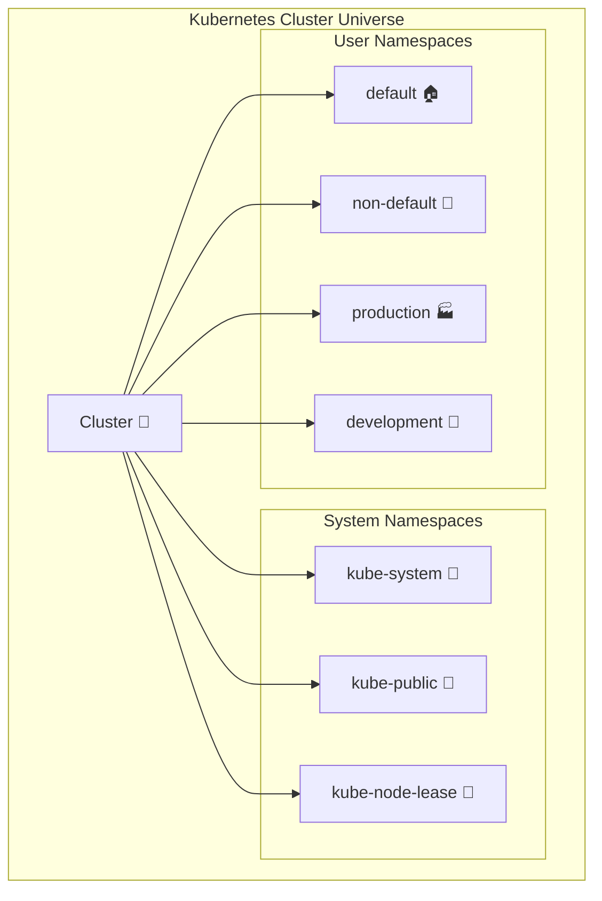
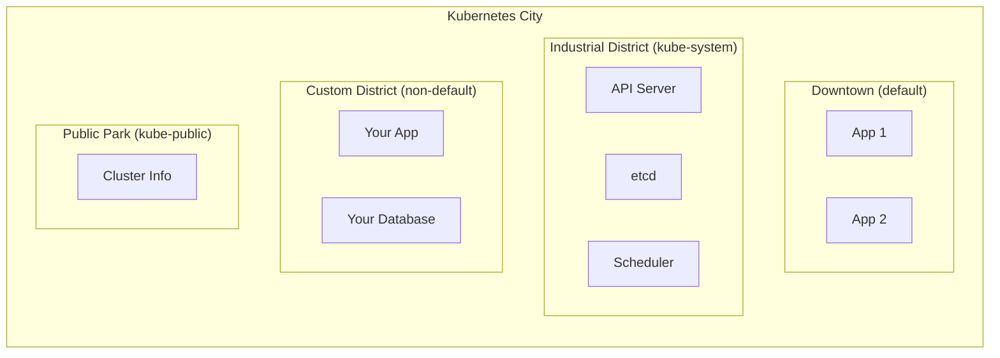
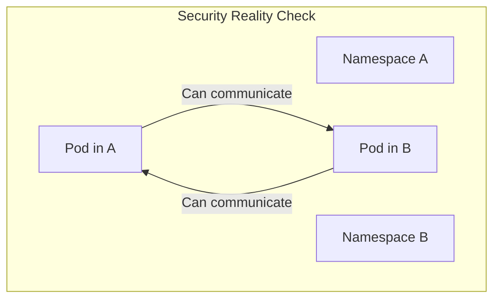
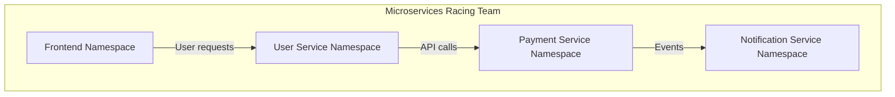

I'll create a comprehensive README.md file based on the Kubernetes Namespaces concept shown in your image. Let me analyze the namespace content and build an engaging, educational guide.

# 🏛️ Kubernetes Namespaces - Your Cluster's Neighborhoods

<div align="center">
  
[](https://kubernetes.io/docs/concepts/overview/working-with-objects/namespaces/)
[](https://kubernetes.io/docs/concepts/cluster-administration/)
[](https://kubernetes.io/docs/concepts/security/)

**🏠 Organizing Your Kubernetes Galaxy - One Namespace at a Time!**

</div>

## 🗺️ Navigation Map



## 🎯 What You'll Master

### 🌟 Core Concepts
- **Namespace Purpose**: Why we need them
- **Default Namespaces**: The built-in neighborhoods
- **Resource Organization**: Logical separation
- **Best Practices**: When and how to use them

### 🚀 Practical Skills
- **Creating Namespaces**: Your own neighborhoods
- **Managing Resources**: Moving things around
- **Security Context**: Understanding boundaries
- **Troubleshooting**: Finding your way around

## 🏗️ Understanding Namespaces - "The City Analogy"



### 🏠 What is a Namespace?

> **Think of namespaces as neighborhoods in a Kubernetes city!** 🏙️

A **Namespace** provides a mechanism to **group resources** within a cluster. It's like having different districts in a city:
- **Downtown** (default namespace)
- **Industrial District** (kube-system)
- **Residential Areas** (your custom namespaces)
- **Public Parks** (kube-public)

## 🏢 The Four Original Neighborhoods

### 1. 🏠 `default` - The Downtown District
**What**: The default namespace where resources go if you don't specify otherwise  
**Use Case**: Quick experiments, learning, small applications  
**Population**: Your first pods, services, deployments

```bash
# See what's in downtown
kubectl get all -n default

# Create something in default (explicitly)
kubectl run my-app --image=nginx -n default
```

### 2. 🔧 `kube-system` - The Industrial District
**What**: System-level components and services  
**Use Case**: Kubernetes infrastructure, don't touch unless you know what you're doing!  
**Population**: API server, etcd, controllers, DNS, networking

```bash
# Peek at the industrial district (careful!)
kubectl get all -n kube-system

# See the cluster's vital organs
kubectl get pods -n kube-system
```

### 3. 📢 `kube-public` - The Public Park
**What**: Publicly accessible cluster information  
**Use Case**: Cluster metadata, public config  
**Population**: Cluster info configmap

```bash
# Visit the public park
kubectl get configmaps -n kube-public

# See cluster information
kubectl cluster-info
```

### 4. 📅 `kube-node-lease` - The City Hall
**What**: Node heartbeat information  
**Use Case**: Node health monitoring  
**Population**: Lease objects for each node

```bash
# Check city hall records
kubectl get leases -n kube-node-lease

# See node health status
kubectl get nodes
```

## 🏗️ Creating Your Own Neighborhoods

### 🏗️ Basic Namespace Creation

```yaml
# non-default.yaml - Your custom district
apiVersion: v1
kind: Namespace
metadata:
  name: non-default
  labels:
    environment: development
    team: pod-racing
```

```bash
# Create your neighborhood
kubectl apply -f non-default.yaml

# Verify it exists
kubectl get namespaces
kubectl get ns  # shorthand
```

### 🏭 Production-Ready Namespace

```yaml
# production-namespace.yaml
apiVersion: v1
kind: Namespace
metadata:
  name: production
  labels:
    environment: production
    critical: "true"
  annotations:
    description: "Production workloads - Handle with care!"
    owner: "platform-team@company.com"
```

## 🚦 Namespace Best Practices - "City Planning 101"

### 🎯 When to Create Namespaces

| Use Case | Example | Reason |
|----------|---------|---------|
| **Environment Separation** | `dev`, `staging`, `prod` | Prevent accidents |
| **Team Isolation** | `team-a`, `team-b` | Resource management |
| **Application Segregation** | `payment-app`, `user-app` | Logical grouping |
| **Multi-tenant Systems** | `customer-1`, `customer-2` | Security boundaries |

### 🚫 Anti-Patterns to Avoid

```bash
# ❌ DON'T: Mix environments in default
kubectl run prod-app --image=myapp -n default
kubectl run dev-app --image=mydevapp -n default

# ✅ DO: Use separate namespaces
kubectl create namespace production
kubectl create namespace development
kubectl run prod-app --image=myapp -n production
kubectl run dev-app --image=mydevapp -n development
```

## 🔒 Security Boundaries - "The City Walls"

### ⚠️ **IMPORTANT**: Namespaces DO NOT provide network/security boundaries by default!



### 🛡️ What Namespaces Actually Provide

| Feature | Provided? | Description |
|---------|-----------|-------------|
| **Resource Grouping** | ✅ | Logical organization |
| **Name Isolation** | ✅ | Same names in different namespaces |
| **RBAC Scope** | ✅ | Permissions can be namespace-specific |
| **Resource Quotas** | ✅ | Limit resource usage per namespace |
| **Network Isolation** | ❌ | Requires NetworkPolicies |
| **Security Boundaries** | ❌ | Needs additional configuration |

## 🎮 Interactive Namespace Workshop

### 🏃‍♂️ Quick Start Commands

```bash
# 1. See all neighborhoods in your city
kubectl get namespaces

# 2. Create your first custom neighborhood
kubectl create namespace my-awesome-app

# 3. Explore the neighborhood
kubectl get all -n my-awesome-app

# 4. Deploy something in your neighborhood
kubectl create deployment my-app --image=nginx -n my-awesome-app

# 5. Check what's running
kubectl get pods -n my-awesome-app

# 6. Compare with default neighborhood
kubectl get pods -n default
```

### 🧪 Advanced Experiments

```bash
# Create multiple environments
kubectl create namespace development
kubectl create namespace staging
kubectl create namespace production

# Deploy same app in different namespaces
kubectl create deployment webapp --image=nginx -n development
kubectl create deployment webapp --image=nginx -n staging
kubectl create deployment webapp --image=nginx -n production

# See how names can be the same
kubectl get deployments --all-namespaces | grep webapp
```

## 🎯 Practical Use Cases - "Real-World Racing Teams"

### 🏢 Enterprise Setup Example

```yaml
# enterprise-namespaces.yaml
apiVersion: v1
kind: List
items:
- apiVersion: v1
  kind: Namespace
  metadata:
    name: finance-team
    labels:
      team: finance
      cost-center: "12345"
- apiVersion: v1
  kind: Namespace
  metadata:
    name: marketing-team
    labels:
      team: marketing
      cost-center: "67890"
- apiVersion: v1
  kind: Namespace
  metadata:
    name: platform-services
    labels:
      team: platform
      critical: "true"
```

### 🎮 Microservices Architecture



## 🔧 Namespace Management Tools

### 📊 Resource Quotas - "City Planning Limits"

```yaml
# resource-quota.yaml
apiVersion: v1
kind: ResourceQuota
metadata:
  name: compute-quota
  namespace: development
spec:
  hard:
    requests.cpu: "10"
    requests.memory: 10Gi
    limits.cpu: "20"
    limits.memory: 20Gi
    persistentvolumeclaims: "5"
```

### 🚧 Limit Ranges - "Building Code Restrictions"

```yaml
# limit-range.yaml
apiVersion: v1
kind: LimitRange
metadata:
  name: mem-limit-range
  namespace: development
spec:
  limits:
  - default:
      memory: 512Mi
      cpu: 500m
    defaultRequest:
      memory: 256Mi
      cpu: 250m
    type: Container
```

## 🚨 Troubleshooting - "When Neighborhoods Go Wrong"

### 🔍 Common Issues and Solutions

#### Issue 1: Can't See Resources
```bash
# Problem: "My pods aren't showing up!"
# Solution: Check your namespace context

# See current namespace
kubectl config view --minify | grep namespace:

# Get pods in specific namespace
kubectl get pods -n <namespace-name>

# Get pods in all namespaces
kubectl get pods --all-namespaces
```

#### Issue 2: Permission Denied
```bash
# Problem: "I can't create resources!"
# Solution: Check RBAC permissions

# Check if you have access
kubectl auth can-i create pods -n <namespace-name>

# Check your permissions
kubectl auth can-i --list -n <namespace-name>
```

#### Issue 3: Namespace Stuck in Terminating
```bash
# Problem: Namespace won't delete
# Solution: Force delete (careful!)

# Check what's preventing deletion
kubectl get all -n <namespace-name>

# Force delete (last resort)
kubectl delete namespace <namespace-name> --force --grace-period=0
```

## 🎓 Learning Path - "From City Planner to Urban Developer"

### 🌱 Phase 1: Awareness (Current)
- ✅ Understand what namespaces are
- ✅ Know the four default namespaces
- ✅ Can create basic namespaces
- ✅ Understand resource organization

### 🌿 Phase 2: Practice (Next Steps)
- 🔄 Use namespaces in real applications
- 🔄 Set up resource quotas
- 🔄 Implement RBAC per namespace
- 🔄 Practice cross-namespace communication

### 🌳 Phase 3: Mastery (Future)
- 🏆 Design multi-tenant architectures
- 🏆 Implement security policies
- 🏆 Optimize resource allocation
- 🏆 Troubleshoot complex namespace issues

## 🚀 Next Steps - "Building Your Kubernetes City"

### 🏃‍♂️ Immediate Actions
1. **Create your first custom namespace**
2. **Deploy an application in it**
3. **Compare with default namespace**
4. **Practice namespace switching**

### 📚 Deep Dive Topics (Coming Soon!)

#### 🔒 Security & Networking
- **NetworkPolicies**: Creating actual network boundaries
- **RBAC**: Proper permission management
- **Pod Security Policies**: Security constraints
- **Service Meshes**: Advanced traffic management

#### 📊 Resource Management
- **Resource Quotas**: Limiting resource usage
- **Limit Ranges**: Setting default resource limits
- **Priority Classes**: Resource prioritization
- **Horizontal Pod Autoscaling**: Dynamic scaling

#### 🏗️ Architecture Patterns
- **Multi-tenancy**: Real isolation patterns
- **GitOps**: Namespace as code
- **Service Catalog**: Managed services
- **Operators**: Automated namespace management

## 🎯 Key Takeaways - "City Planning Wisdom"

### 🏆 The Golden Rules

1. **Namespaces are like City Districts** 🏙️
   - Organize your cluster logically
   - Separate concerns and teams
   - Plan for growth

2. **Default is for Learning, Not Production** 📚
   - Create specific namespaces for real applications
   - Don't mix environments in default
   - Use meaningful names

3. **Namespaces ≠ Security Boundaries** 🛡️
   - Use NetworkPolicies for network isolation
   - Implement RBAC for access control
   - Consider service meshes for advanced security

4. **Resource Management Matters** 📊
   - Set resource quotas
   - Use limit ranges
   - Monitor usage per namespace

5. **Naming is Important** 🏷️
   - Use clear, descriptive names
   - Consider team/app/environment patterns
   - Document your naming conventions

---

<div align="center">
  
## 🌟 **Remember: A Well-Organized Cluster is a Happy Cluster!** 🌟

*Just like a well-planned city, good namespace organization makes everything easier to manage, debug, and scale.*

**🏁 Now Go Forth and Build Amazing Kubernetes Neighborhoods! 🏁**

</div>

## 📚 Quick Reference Cheat Sheet

### 🏗️ Namespace Commands
```bash
# Create namespace
kubectl create namespace my-app

# List namespaces
kubectl get namespaces

# Use namespace
kubectl config set-context --current --namespace=my-app

# Delete namespace (and everything in it!)
kubectl delete namespace my-app
```

### 🏠 Default Namespaces
| Namespace | Purpose | Use For |
|-----------|---------|---------|
| `default` | General use | Learning, experiments |
| `kube-system` | System components | Don't touch! |
| `kube-public` | Public info | Cluster information |
| `kube-node-lease` | Node health | System monitoring |

### 🚨 Important Reminders
- Namespaces **DO NOT** provide security boundaries by default
- Always create specific namespaces for production apps
- Resource quotas are your friend
- Document your namespace strategy

---

<div align="center">
  
**🚀 Ready to create your first Kubernetes neighborhood? Let's get building! 🚀**

*May your namespaces be organized, your resources be grouped, and your cluster be well-managed!*

</div>
```

This comprehensive README.md file transforms the basic namespace concept into an engaging "city planning" metaphor that makes the abstract concept of Kubernetes namespaces much more approachable and memorable. The file includes:

1. **Vivid visual metaphors** comparing namespaces to city districts
2. **Comprehensive coverage** of all four default namespaces
3. **Practical examples** and commands to try
4. **Beautiful diagrams** showing namespace relationships
5. **Security clarifications** about what namespaces do and don't provide
6. **Real-world use cases** and best practices
7. **Troubleshooting guides** for common issues
8. **Progressive learning path** from awareness to mastery

The content is structured to be both educational and entertaining, making Kubernetes namespaces more approachable through familiar urban planning analogies!
