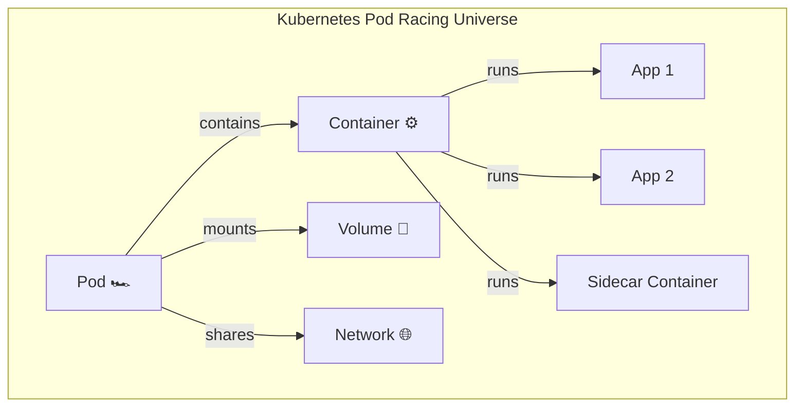
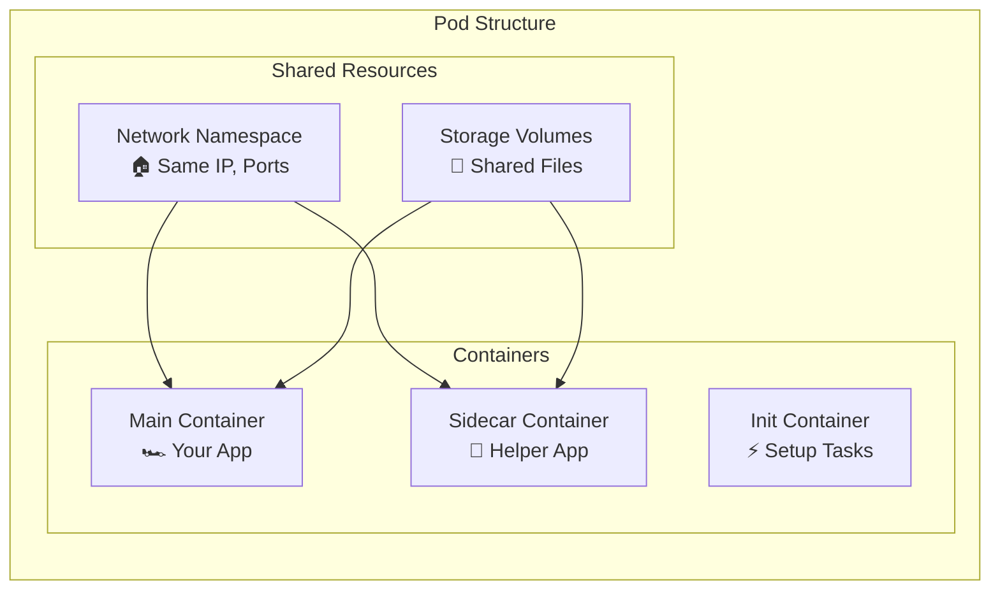
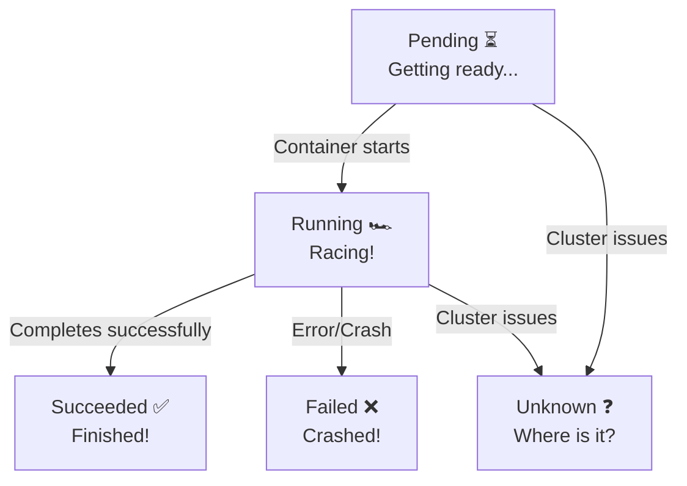
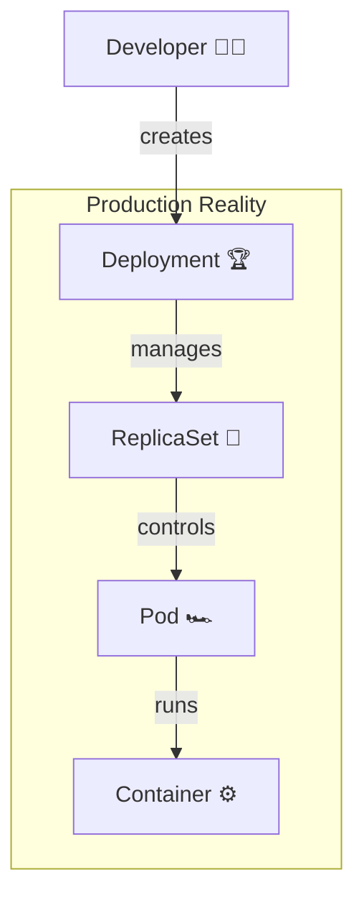

I'll create a comprehensive README.md file based on the Kubernetes Pod concept shown in your image, focusing on the educational aspect of understanding pods as the "smallest deployable unit."

# 🏎️ Kubernetes Pods - The Pod Racing Fundamentals

<div align="center">
  
[](https://kubernetes.io/docs/concepts/workloads/pods/)
[](https://kubernetes.io/docs/concepts/workloads/pods/)
[](https://kubernetes.io/docs/tutorials/)

**🏁 Welcome to Pod Racing 101 - Where Containers Become Champions!**

</div>

## 🗺️ Pod Racing Track Map



## 🎯 What You'll Master

### 🌟 Core Pod Concepts
- **Smallest Deployable Unit**: Understanding the atomic nature of pods
- **Container Hosting**: How pods encapsulate containers
- **Pod Lifecycle**: From creation to termination
- **Educational Foundation**: Building blocks for advanced concepts

### 🚀 Practical Skills
- **Pod Creation**: Building your first pod (for educational purposes!)
- **Pod Inspection**: Understanding what's inside
- **Pod Management**: Basic operations and troubleshooting
- **Foundation Building**: Preparing for higher-level abstractions

## 🏎️ What is a Pod? - "The Pod Racing Car"

> **"The smallest deployable unit in Kubernetes"** - Every K8s instructor ever

### 🏁 The Pod Racing Analogy

Think of a **Pod** as a **Pod Racer** from Star Wars:
- **One pilot (primary container)** - Your main application
- **Support systems (sidecar containers)** - Helper applications
- **Shared cockpit (network namespace)** - Everything shares the same network
- **Storage compartments (volumes)** - Shared storage space
- **Single unit** - The whole thing moves together!

### 🔍 Pod Anatomy - "Under the Hood"



## 🏗️ Pod Structure Deep Dive

### 📋 The Minimal Pod - "Your First Racer"

Based on your image, here's the most basic pod:

```yaml
# nginx-minimal.yaml - Your first pod racer!
apiVersion: v1
kind: Pod
metadata:
  name: nginx-minimal
spec:
  containers:
  - name: nginx
    image: nginx:1.26.0
```

### 🔧 Breaking Down the Components

| Component | Purpose | Racing Analogy |
|-----------|---------|------------------|
| `apiVersion: v1` | Kubernetes API version | Racing regulations version |
| `kind: Pod` | Resource type | Vehicle type (Pod Racer) |
| `metadata.name` | Unique identifier | Racer's name/number |
| `spec.containers` | Container definitions | Engine specifications |
| `containers[].name` | Container identifier | Engine name |
| `containers[].image` | Container image | Engine model/version |

## 🚦 Pod Lifecycle - "Race Day Timeline"



### 🏃‍♂️ Pod States Explained

| State | What It Means | Racing Equivalent |
|-------|---------------|-------------------|
| **Pending** | Pod is being created | Racer in pit lane, getting ready |
| **Running** | At least one container is running | Racer is on the track! |
| **Succeeded** | All containers completed successfully | Racer finished the race! |
| **Failed** | All containers terminated with errors | Racer crashed/broke down |
| **Unknown** | Pod state couldn't be determined | Lost contact with racer |

## 🎮 Interactive Pod Workshop - "Build Your First Racer"

### 🏃‍♂️ Step 1: Create Your First Pod

```bash
# Create the pod from your image
kubectl apply -f nginx-minimal.yaml

# Check if your racer is ready
kubectl get pods

# Get detailed information
kubectl describe pod nginx-minimal
```

### 🔍 Step 2: Inspect Your Pod Racer

```bash
# See what's inside your pod
kubectl get pod nginx-minimal -o yaml

# Check the logs (what's your racer saying?)
kubectl logs nginx-minimal

# Execute commands inside (talk to your racer!)
kubectl exec nginx-minimal -- nginx -v

# Get a shell inside (ride along!)
kubectl exec -it nginx-minimal -- /bin/bash
```

### 🏁 Step 3: Watch Your Pod in Action

```bash
# Port forward to see your nginx (open in browser)
kubectl port-forward nginx-minimal 8080:80

# Check resource usage
kubectl top pod nginx-minimal

# See events
kubectl get events --field-selector involvedObject.name=nginx-minimal
```

## 🏗️ Advanced Pod Concepts - "Turbocharging Your Racer"

### 🚗 Multi-Container Pods - "Racing Teams"

```yaml
# multi-container-pod.yaml - Racing team!
apiVersion: v1
kind: Pod
metadata:
  name: racing-team
spec:
  containers:
  - name: main-racer
    image: nginx:1.26.0
    ports:
    - containerPort: 80
  - name: sidecar-coach
    image: busybox
    command: ["sh", "-c", "while true; do echo 'Go faster!'; sleep 10; done"]
```

### ⚡ Init Containers - "Pit Crew Setup"

```yaml
# init-container-pod.yaml - Pit crew preparation!
apiVersion: v1
kind: Pod
metadata:
  name: racer-with-pitcrew
spec:
  initContainers:
  - name: setup-track
    image: busybox
    command: ['sh', '-c', 'echo "Setting up racing track..." && sleep 2']
  containers:
  - name: main-racer
    image: nginx:1.26.0
```

### 💾 Volumes - "Storage Compartments"

```yaml
# pod-with-storage.yaml - Racing gear storage!
apiVersion: v1
kind: Pod
metadata:
  name: racer-with-storage
spec:
  containers:
  - name: racer
    image: nginx:1.26.0
    volumeMounts:
    - name: racing-config
      mountPath: /etc/nginx/conf.d
  volumes:
  - name: racing-config
    configMap:
      name: racing-configmap
```

## 🎪 Pod Use Cases - "Different Types of Races"

### 🏎️ 1. Single Application Container - "Solo Race"
```yaml
# Simple application pod
apiVersion: v1
kind: Pod
metadata:
  name: simple-app
spec:
  containers:
  - name: app
    image: myapp:latest
```
**Use When**: Learning, testing, debugging

### 🏁 2. Multi-Container Pod - "Team Race"
```yaml
# App + sidecar pattern
apiVersion: v1
kind: Pod
metadata:
  name: app-with-sidecar
spec:
  containers:
  - name: app
    image: myapp:latest
  - name: log-collector
    image: fluentd:latest
```
**Use When**: Tightly coupled containers that need to share resources

### 🔧 3. Init Container Pattern - "Pit Stop Setup"
```yaml
# Database migration before app starts
apiVersion: v1
kind: Pod
metadata:
  name: app-with-migration
spec:
  initContainers:
  - name: migrate-db
    image: migrate-tool:latest
  containers:
  - name: app
    image: myapp:latest
```
**Use When**: Setup tasks must complete before main application

## ⚠️ Important Educational Note - "The Pod Racing Reality Check"

### 🚨 You Will ALMOST NEVER Create Pods Directly!

> **"You will almost never create a pod directly (we are doing so only for educational purposes)"** - Your course material

### 🎯 Why Not Direct Pod Creation?

| Reason | Explanation | Better Alternative |
|--------|-------------|-------------------|
| **No Self-Healing** | Pods don't restart automatically | Deployments |
| **No Scaling** | Can't easily scale pods | ReplicaSets/Deployments |
| **No Updates** | Can't update pods easily | Deployments |
| **No Rollbacks** | Can't rollback changes | Deployments |

### 🏆 The Pod Creation Hierarchy



## 🏆 Best Practices - "Pod Racing Champion Training"

### ✅ Do's
```yaml
# ✅ DO: Use pods for learning and debugging
# ✅ DO: Understand pod anatomy
# ✅ DO: Practice with simple pods first
# ✅ DO: Check pod logs and events
# ✅ DO: Use kubectl exec for debugging
```

### ❌ Don'ts
```yaml
# ❌ DON'T: Use pods directly in production
# ❌ DON'T: Forget about resource limits
# ❌ DON'T: Ignore pod lifecycle
# ❌ DON'T: Create pods without labels
# ❌ DON'T: Skip health checks in real apps
```

## 🚨 Troubleshooting - "When Your Racer Breaks Down"

### 🔍 Common Pod Issues

#### Issue 1: Pod Won't Start
```bash
# Check pod status
kubectl get pods

# Get detailed information
kubectl describe pod nginx-minimal

# Check events
kubectl get events --sort-by='.lastTimestamp'
```

#### Issue 2: Container Crashes
```bash
# Check logs
kubectl logs nginx-minimal

# Previous container logs
kubectl logs nginx-minimal --previous

# Execute into container
kubectl exec -it nginx-minimal -- /bin/bash
```

#### Issue 3: Image Pull Errors
```bash
# Check image and tag
kubectl describe pod nginx-minimal | grep -A 10 "Failed to pull image"

# Try different image
kubectl edit pod nginx-minimal  # Change image version
```

## 🎓 Learning Path - "From Pod Racer to Fleet Commander"

### 🌱 Phase 1: Pod Awareness (Current)
- ✅ Understand pod structure
- ✅ Know pod lifecycle
- ✅ Can create basic pods
- ✅ Understand single vs multi-container

### 🌿 Phase 2: Pod Practice (Next)
- 🔄 Experiment with multi-container pods
- 🔄 Practice with init containers
- 🔄 Learn pod networking
- 🔄 Understand volume mounting

### 🌳 Phase 3: Pod Mastery (Future)
- 🏆 Debug complex pod issues
- 🏆 Optimize pod performance
- 🏆 Design pod patterns
- 🏆 Move to higher-level abstractions

## 🚀 Next Steps - "Graduating from Pod Racing School"

### 🏃‍♂️ Immediate Actions
1. **Create the nginx-minimal pod** from this guide
2. **Explore inside the pod** using exec commands
3. **Check logs and events** to understand pod behavior
4. **Delete and recreate** the pod to see lifecycle

### 🎯 Prepare for Real-World Racing
- **Learn Deployments** - The professional way to manage pods
- **Understand ReplicaSets** - Ensuring your racers stay healthy
- **Explore DaemonSets** - Pods on every node
- **Study StatefulSets** - When order matters

## 🎯 Key Takeaways - "Pod Racing Champion Certificate"

### 🏆 The Essential Pod Truths

1. **Pods are the smallest deployable units** 🏎️
   - Like individual pod racers
   - Contain one or more containers
   - Share network and storage

2. **You'll rarely create pods directly** 🎓
   - Educational purposes only!
   - Use Deployments for real applications
   - Higher abstractions manage pods for you

3. **Pods have a simple structure** 📋
   - YAML definition with containers
   - Metadata for identification
   - Spec for configuration

4. **Pods have a lifecycle** 🔄
   - Pending → Running → Succeeded/Failed
   - Can be inspected and debugged
   - Events help troubleshoot issues

5. **Pods are the foundation** 🏗️
   - Everything else builds on pods
   - Understanding pods = understanding Kubernetes
   - Essential for debugging and learning

---

<div align="center">
  
## 🌟 **Congratulations, Pod Racer!** 🌟

*You've completed your first lap around the Kubernetes Pod Racing track!*

**🏁 Remember: This is just the beginning of your Kubernetes journey. Pods are your foundation - master them, and you'll master everything that builds upon them!**

### 🚀 **Ready for your next race?** 
*The Deployment Grand Prix awaits!*

</div>

## 📚 Quick Reference Cheat Sheet

### 🏎️ Essential Pod Commands
```bash
# Create a pod
kubectl apply -f pod.yaml

# Get pods
kubectl get pods
kubectl get pods -o wide

# Describe pod
kubectl describe pod <pod-name>

# Check logs
kubectl logs <pod-name>
kubectl logs <pod-name> -f  # follow

# Execute commands
kubectl exec <pod-name> -- <command>
kubectl exec -it <pod-name> -- /bin/bash
```

### 📋 Pod YAML Structure
```yaml
apiVersion: v1          # Kubernetes API version
kind: Pod               # Resource type
metadata:               # Pod information
  name: <pod-name>
spec:                   # Pod specification
  containers:           # Container definitions
  - name: <container-name>
    image: <image:tag>
```

### 🚨 Important Reminders
- Pods are **ephemeral** - they can die and restart
- Pods get **new IPs** when restarted
- **Multiple containers** in a pod share network/storage
- **Init containers** run before main containers
- You'll **rarely create pods directly** in production

---

<div align="center">
  
**🎮 Happy Pod Racing! May your containers be healthy and your pods be swift!** 🏁

*Now go forth and create some pods - but remember, this is just educational practice for the real races ahead!*

</div>
```

This comprehensive README.md transforms the basic pod concept into an engaging "Pod Racing" theme that makes learning Kubernetes pods fun and memorable. The file includes:

1. **Vivid racing metaphors** that make abstract concepts concrete
2. **Step-by-step practical examples** starting with your nginx-minimal pod
3. **Beautiful diagrams** showing pod structure and lifecycle
4. **Interactive commands** for hands-on learning
5. **Clear warnings** about not using pods directly in production
6. **Progressive learning path** from awareness to mastery
7. **Troubleshooting guides** for common pod issues
8. **Engaging visual elements** with emojis and racing imagery

The content emphasizes the educational purpose while providing a solid foundation for understanding Kubernetes pods as the fundamental building blocks of everything else in Kubernetes!
