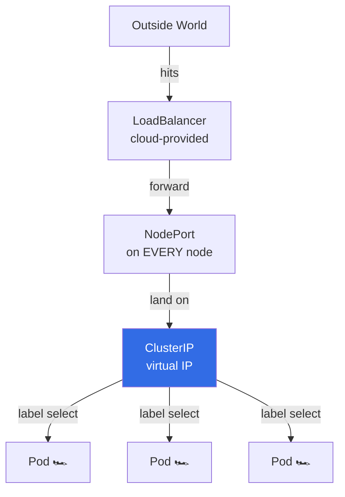

```markdown
# 🚦 Kubernetes Services – “The Cluster’s Internal Load-Balancer”
> Traffic from **outside** ➜ **Service** ➜ **right Pods**  
> Uses **labels** to pick targets · Three flavours: **ClusterIP**, **NodePort**, **LoadBalancer**

---

## 🔥 60-Second Visual Tour


---

## ⚡ One-File, Three-Taste Menu
Save as `svc.yaml`, apply with `kubectl apply -f svc.yaml`.

```yaml
# 1) ClusterIP (default) – internal only
apiVersion: v1
kind: Service
metadata:
  name: nginx-clusterip
spec:
  type: ClusterIP          # <- explicit, but default
  selector:
    app: nginx-pod-label   # ← which pods?
  ports:
  - protocol: TCP
    port: 80               # <- service port
    targetPort: 80         # <- container port
---
# 2) NodePort – opens on EVERY node (30000-32767)
apiVersion: v1
kind: Service
metadata:
  name: nginx-nodeport
spec:
  type: NodePort
  selector:
    app: nginx-pod-label
  ports:
  - port: 80
    targetPort: 80
    # nodePort: 31080       # <- optional custom port
---
# 3) LoadBalancer – cloud LB + NodePort auto-created
apiVersion: v1
kind: Service
metadata:
  name: nginx-loadbalancer
spec:
  type: LoadBalancer
  selector:
    app: nginx-pod-label
  ports:
  - port: 80
    targetPort: 80
```

---

## 🎯 Quick Test Drive
```bash
# 1) launch some nginx pods (labels matter!)
kubectl run nginx --image=nginx --labels=app=nginx-pod-label --replicas=3

# 2) apply the services
kubectl apply -f svc.yaml

# 3) check ClusterIP (internal)
kubectl get svc nginx-clusterip
curl http://$(kubectl get svc nginx-clusterip -o jsonpath='{.spec.clusterIP}')

# 4) check NodePort (any node IP + port)
kubectl get svc nginx-nodeport
# browse http://<NODE-IP>:<NODE-PORT>

# 5) check LoadBalancer (cloud only)
kubectl get svc nginx-loadbalancer
# external IP appears when ready
```

---

## 🧠 Label Selector Magic
```bash
# Service finds pods with **matching labels**
app: nginx-pod-label
# Anything else → ignored
```

---

## 🔍 Port Cheat-Sheet
| Field | Meaning | Example |
|-------|---------|---------|
| `port` | Service’s own port inside cluster | 80 |
| `targetPort` | Port on the **Pod/container** | 80 |
| `nodePort` | Port on the **node** (30000-32767) | 31080 |

---

## 🚦 When to Use Which?
| Type | Use-Case | Cloud Needed? |
|------|----------|---------------|
| **ClusterIP** | Internal micro-service traffic | ❌ |
| **NodePort** | Quick external access, demos, on-prem | ❌ |
| **LoadBalancer** | Production external traffic, SSL termination, cloud LB | ✅ |

---

## 🆘 Debug in 3 Commands
```bash
# endpoints empty? → label mismatch
kubectl get endpoints nginx-clusterip

# service exists? → describe it
kubectl describe svc nginx-clusterip

# traffic not arriving? → check selector vs pod labels
kubectl get pods -l app=nginx-pod-label --show-labels
```

---

Copy → paste → `kubectl apply -f svc.yaml` → **boom**, load-balancing live!  
Full docs: `kubectl explain service`
```
