# 🕰️ Kubernetes CronJob – “The Cluster’s Alarm Clock” 
> Adds a **schedule** (`*****`) · **Launches a Job periodically** · **Job runs → completes → waits for next tick**

---

## 🔥 10-Second Visual

```mermaid
graph TD
    Time[Time / Cron] -->|every minute| CJ[CronJob 🕰️]
    CJ -->|spawns| J[Job 🏁]
    J -->|creates| P[Pod 🏎️]
    P -->|runs & exits| Done([Complete ✅])
    Done -->|next tick| CJ
    style CJ fill:#ffcc02,stroke:#333
```


---

## ⚡ One-File, One-Command Demo
Save as `cj.yaml`, apply, watch a new pod every minute:

```yaml
apiVersion: batch/v1
kind: CronJob
metadata:
  name: echo-date-minimal
spec:
  schedule: "* * * * *"        # ← cron syntax (every minute)
  jobTemplate:
    spec:
      backoffLimit: 1
      template:
        spec:
          restartPolicy: Never
          containers:
          - name: echo
            image: busybox:1.36.1
            command: ["date"]
```

```bash
kubectl apply -f cj.yaml
kubectl get cj,job,pods -l app=echo-date-minimal --watch
# → new pod appears every 60s, prints timestamp, exits
```

---

## 🧠 Cron Syntax Mini-Poster
| Field | Meaning | Range |
|-------|---------|-------|
| minute | 0-59 | `*` |
| hour | 0-23 | `*` |
| day-of-month | 1-31 | `*` |
| month | 1-12 | `*` |
| day-of-week | 0-7 (Sun=0/7) | `*` |

**Quick presets**  
`"* * * * *"` every minute  
`"0 * * * *"` every hour  
`"0 2 * * *"` daily at 02:00  
`"0 0 * * 0"` every Sunday midnight

---

## 🔍 Useful Flags in 1 Table
| Flag | Default | Purpose |
|------|---------|---------|
| `concurrencyPolicy` | Allow | Allow / Forbid / Replace overlapping jobs |
| `startingDeadlineSeconds` | 200 | Skip tick if scheduler missed > X s |
| `successfulJobsHistoryLimit` | 3 | How many finished jobs to keep |
| `suspend` | false | Pause the schedule without deleting object |

Example with extras:
```yaml
spec:
  schedule: "0 2 * * *"
  concurrencyPolicy: Forbid
  successfulJobsHistoryLimit: 5
  suspend: false
  jobTemplate: ...
```

---

## 🎮 Instant Experiments
```bash
# 1) see next scheduled times
kubectl get cronjob echo-date-minimal -o jsonpath='{.status.nextScheduleTime}'

# 2) pause / resume
kubectl patch cronjob echo-date-minimal -p '{"spec":{"suspend":true}}'
kubectl patch cronjob echo-date-minimal -p '{"spec":{"suspend":false}}'

# 3) manual trigger (adhoc job)
kubectl create job echo-date-manual --from=cronjob/echo-date-minimal
```

---

## 🏎️ When to Use CronJob
| Pattern | Example Schedule |
|---------|------------------|
| nightly DB backup | `0 2 * * *` |
| hourly analytics | `0 * * * *` |
| SSL cert check | `0 0 * * 0` |
| micro-service health ping | `*/5 * * * *` |

---

## 🆘 Debug Checklist
```bash
# job never spawned?
kubectl describe cj echo-date-minimal | grep -A5 Events

# too many overlaps?
kubectl get jobs -l app=echo-date-minimal | wc -l

# missed ticks?
kubectl logs -l app=echo-date-minimal --tail=100
```

---

Copy → paste → `kubectl apply -f cj.yaml` → cluster wakes up every minute!  
Full docs: `kubectl explain cronjob`
```
