# 🛠️ Kubernetes DaemonSet – “The Node-Level Pit-Crew”
> Runs **one pod per node** (or per subset) · **Perfect for daemons**: logs, metrics, storage, network · **Auto-adds/removes pods when nodes join/leave**

---

## 🔥 15-Second Visual

```mermaid
graph TD
    Master[Control Plane]
    subgraph "Cluster Nodes"
        N1[Node 1]
        N2[Node 2]
        N3[Node 3]
    end
    DS[DaemonSet 🛠️] -.->|creates| D1[Daemon Pod<br/>on Node 1]
    DS -.->|creates| D2[Daemon Pod<br/>on Node 2]
    DS -.->|creates| D3[Daemon Pod<br/>on Node 3]
    Master --> DS
    style DS fill:#326ce5,color:#fff
```


---

## ⚡ Copy-Paste-Run
Save as `ds.yaml`, apply, watch one pod per node appear:

```yaml
apiVersion: apps/v1
kind: DaemonSet
metadata:
  name: fluentd-minimal
spec:
  selector:
    matchLabels:
      app: fluentd
  template:
    metadata:
      labels:
        app: fluentd
    spec:
      containers:
      - name: fluentd
        image: fluentd:v1.16-1
        volumeMounts:
        - name: varlog
          mountPath: /var/log
      volumes:
      - name: varlog
        hostPath:
          path: /var/log
```

```bash
kubectl apply -f ds.yaml
kubectl get ds,pods -l app=fluentd -o wide
# → one pod per node, auto-spawned on new nodes
```

---

## 🎯 Node Selector / Tolerations in 10 Lines
Run **only** on nodes with SSD:

```yaml
spec:
  template:
    spec:
      nodeSelector:
        disktype: ssd
      tolerations:                # tolerate tainted nodes
      - key: "log"
        operator: "Equal"
        value: "true"
        effect: "NoSchedule"
```

---

## 🔍 Quick Cheat-Sheet
| Task | One-Liner |
|------|-----------|
| **See daemons per node** | `kubectl get pods -l app=fluentd -o wide` |
| **Roll to new image** | `kubectl set image ds/fluentd-minimal fluentd=fluentd:v1.17` |
| **Drain node → daemon pod deleted** | `kubectl drain <node> --ignore-daemonsets` |
| **Delete daemonset** | `kubectl delete ds fluentd-minimal` |

---

## 🏎️ Real-World DaemonSet Uses
| Use-Case | Image Example |
|----------|---------------|
| **Log collector** | `fluentd`, `filebeat` |
| **Metrics exporter** | `node-exporter`, `datadog-agent` |
| **Network plugin** | `calico-node`, `weave-net` |
| **CSI driver** | `aws-ebs-csi-node` |
| **Security scanner** | `falco`, `aqua-agent` |

---

## 🆘 Debug in 3 Commands
```bash
# missing on a node?
kubectl get nodes -l disktype=ssd   # check nodeSelector
kubectl describe node <node> | grep -A5 Taints
kubectl get events --field-selector involvedObject.name=fluentd-minimal
```

---

Copy → paste → `kubectl apply -f ds.yaml` → every node grows a log-collecting daemon!  
Full spec: `kubectl explain daemonset`
```
