# 🧩 Kubernetes StatefulSet – “The Sticky-Pod Orchestra” 
> Like Deployment **BUT** each pod keeps its **identity** (`web-0`, `web-1`…) and **own volume** · **ordered rollout** → perfect for **primary + read-replica** setups

---

## 🔥 20-Second Visual

```mermaid
graph LR
    subgraph "StatefulSet: 3 replicas"
        S[StatefulSet<br/>🎼 Conductor]
        S -->|ordered| P0[Pod-0 🎻<br/>Identity: web-0<br/>PVC: data-web-0]
        S -->|after-0| P1[Pod-1 🎺<br/>Identity: web-1<br/>PVC: data-web-1]
        S -->|after-1| P2[Pod-2 🥁<br/>Identity: web-2<br/>PVC: data-web-2]
    end
    style S fill:#326ce5,color:#fff
```


---

## ⚡ Copy-Paste-Run
Save as `sts.yaml`, apply, watch **ordered** birth with **sticky names & volumes**:

```yaml
apiVersion: apps/v1
kind: StatefulSet
metadata:
  name: nginx-with-init-container
spec:
  serviceName: nginx-headless   # headless service required
  replicas: 3
  selector:
    matchLabels:
      app: nginx
  template:
    metadata:
      labels:
        app: nginx
    spec:
      initContainers:
      - name: populate-default-html
        image: nginx:1.26.0
        command:
        - bash
        - -c
        - |
          set -ex
          echo "Hello from pod $(hostname)" > /usr/share/nginx/html/index.html
        volumeMounts:
        - name: data
          mountPath: /usr/share/nginx/html
      containers:
      - name: nginx
        image: nginx:1.26.0
        ports:
        - containerPort: 80
        volumeMounts:
        - name: data
          mountPath: /usr/share/nginx/html
  volumeClaimTemplates:   # ← PVC template per pod
  - metadata:
      name: data
    spec:
      accessModes: ["ReadWriteOnce"]
      storageClassName: standard
      resources:
        requests:
          storage: 100Mi
```

```bash
kubectl apply -f sts.yaml
kubectl get pods -l app=nginx -w
# → web-0 Running, then web-1, then web-2 (never random)
kubectl get pvc
# → data-web-0, data-web-1, data-web-2 (sticky forever)
```

---

## 🎯 Headless Service (Required!)
StatefulSet needs a **stable network ID**; create once:

```yaml
apiVersion: v1
kind: Service
metadata:
  name: nginx-headless
spec:
  clusterIP: None   # ← headless
  selector:
    app: nginx
  ports:
  - port: 80
```

Now pods are reachable via:  
`web-0.nginx-headless.default.svc.cluster.local`

---

## 🔍 Quick Cheat-Sheet
| Task | One-Liner |
|------|-----------|
| **See ordered pods** | `kubectl get pods -l app=nginx` |
| **Scale up (ordered)** | `kubectl scale sts nginx-with-init-container --replicas=5` |
| **Rolling update** | `kubectl set image sts/nginx-with-init-container nginx=nginx:1.27` |
| **Delete a pod (it respawns same name)** | `kubectl delete pod web-1` |
| **PVC stuck?** | `kubectl delete pvc data-web-1` (pod must be gone first) |

---

## 🏎️ Real-World Patterns
| Pattern | Image Example | Benefit |
|---------|---------------|---------|
| **Primary + Replicas** | Postgres, MySQL | each replica keeps own data |
| **Kafka/ZK ensemble** | `confluentinc/cp-kafka` | stable broker ID & logs |
| **ETCD cluster** | `quay.io/coreos/etcd` | member name & wal dir sticky |

---

## 🆘 Debug in 3 Commands
```bash
# pod not starting in order?
kubectl describe pod web-1 | grep -A5 Events

# PVC pending?
kubectl get pvc data-web-1
kubectl describe pvc data-web-1

# wrong storage class?
kubectl get storageclass
```

---

Copy → paste → `kubectl apply -f sts.yaml` → **ordered, sticky, stateful** pods with **personal disks**!  
Full spec: `kubectl explain statefulset`
```
