# 🔐 Kubernetes Secrets – “ConfigMaps with Armor” 
> Same **mount / env** mechanics as ConfigMaps · **Base64-encoded** (not encrypted!) · Separate **type & RBAC** = manageable **authorization**

---

## 🔥 10-Second Visual

```mermaid
graph TD
    S[Secret 🔐<br/>base64 inside]
    S -->|env| Pod[Pod 🏎️<br/>ENVVARFROMSECRET=bar]
    S -->|volume| Pod2[Pod 🏎️<br/>/etc/config/foo → bar]
    CM[ConfigMap 📋<br/>plain text]
    CM -.->|comparison| S
    style S fill:#ff6b6b,color:#fff
```


---

## ⚡ Two-Line Taste Test
```bash
# 1) create the secret (manifests below)
kubectl apply -f secret.yaml

# 2) launch pod that uses BOTH env & volume
kubectl apply -f pod-secret-demo.yaml

# 3) peek inside (data auto-decoded!)
kubectl exec -it secret-example -- sh -c 'echo $ENVVARFROMSECRET; cat /etc/config/foo'
```

---

## 📄 secret.yaml – Base64 vs Clear Text
```yaml
# BASE64 STYLE (traditional)
apiVersion: v1
kind: Secret
metadata:
  name: base64-data
type: Opaque
data:                     # <- base64 encoded
  foo: YmFy               # echo -n bar | base64
  secret: cGFzc3dvcmQ=
---
# STRING-DATA STYLE (clear text in YAML)
apiVersion: v1
kind: Secret
metadata:
  name: string-data
type: Opaque
stringData:               # <- plain text (kubectl encodes for you)
  foo: bar
  secret: password
```

---

## 📄 pod-secret-demo.yaml – consume as env + volume
```yaml
apiVersion: v1
kind: Pod
metadata:
  name: secret-example
spec:
  containers:
  - name: nginx
    image: nginx:1.26.0
    env:
    - name: ENVVARFROMSECRET
      valueFrom:
        secretKeyRef:
          name: base64-data
          key: foo
    volumeMounts:
    - name: secret-vol
      mountPath: /etc/config
      readOnly: true
  volumes:
  - name: secret-vol
    secret:
      secretName: base64-data
```

---

## 🔍 Quick Commands
| Task | One-Liner |
|------|-----------|
| **create from literals** | `kubectl create secret generic my-secret --from-literal=foo=bar` |
| **create from file** | `kubectl create secret generic my-secret --from-file=ssh-privatekey=id_rsa` |
| **view decoded values** | `kubectl get secret my-secret -o go-template='{{.data.foo | base64decode}}'` |
| **edit live** | `kubectl edit secret my-secret` |
| **delete** | `kubectl delete secret my-secret` |

---

## 🎯 Built-in Types (use `type:`)
| Type | Use-Case | CLI Shortcut |
|------|----------|--------------|
| `Opaque` | generic key/value (default) | `kubectl create secret generic` |
| `kubernetes.io/dockerconfigjson` | registry auth | `kubectl create secret docker-registry` |
| `kubernetes.io/service-account-token` | SA token | auto-created |
| `kubernetes.io/tls` | certs + keys | `kubectl create secret tls` |

---

## 🏎️ Real-World Uses
| Secret | Mount Style | Sample Content |
|--------|-------------|----------------|
| **DB password** | env | `DB_PASS=SuperSecret123` |
| **TLS cert/key** | file | `tls.crt` + `tls.key` |
| **Docker registry auth** | node | `.dockerconfigjson` |
| **Git SSH key** | file | `id_rsa` |

---

## ⚠️ Security Reminders
* Base64 is **encoding**, **NOT encryption**  
* Anyone with `get` on Secret can decode  
* Use **RBAC** to limit who can read Secrets  
* For **encryption at rest** enable `--encryption-provider-config` on API server

---

## 🆘 Debug in 3 Commands
```bash
# value not decoded inside pod?
kubectl exec -it secret-example -- printenv ENVVARFROMSECRET

# wrong key?
kubectl get secret base64-data -o yaml | grep foo

# permission denied?
kubectl auth can-i get secrets -n default
```

---

Copy → paste → `kubectl apply -f secret.yaml` → sensitive data lives **outside** the image and **under RBAC control**!  
Full docs: `kubectl explain secret`
```
